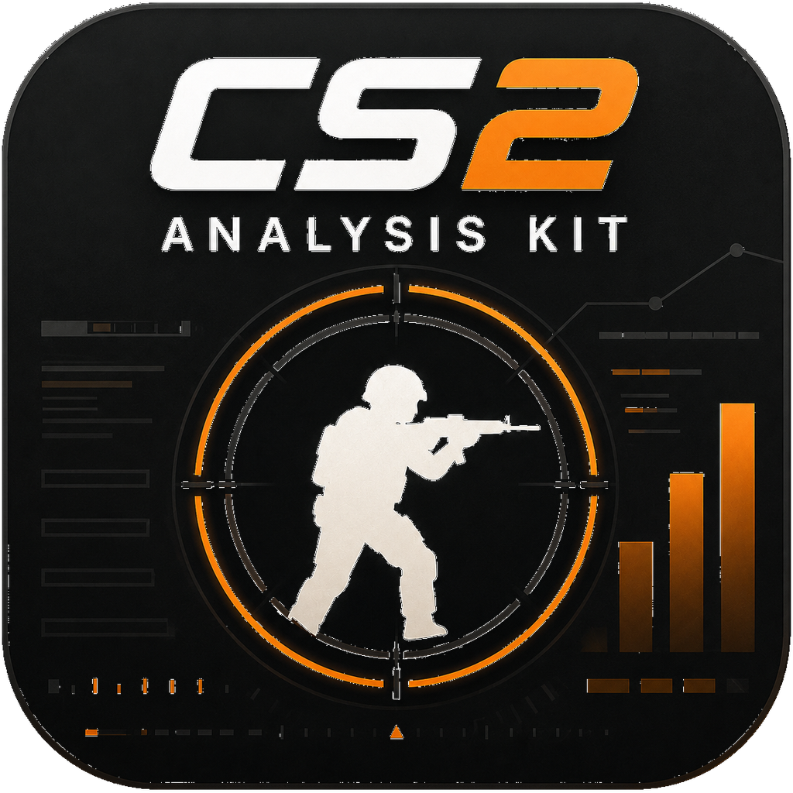

<div align="center">



# CS2 Demo Analysis Kit

**Local-first CS2 demo analysis — every stat links back to the exact round and tick.**

English · [简体中文](./README.zh-CN.md)

[](https://github.com/Starfie1d1272/cs2-demo-analysis-kit/actions)
[](https://github.com/Starfie1d1272/cs2-demo-analysis-kit/releases/latest)
[](#license)
[](https://pypi.org/project/cs2df/)

</div>

---

**DAK Studio** is a desktop workbench that turns a CS2 `.dem` into a full analysis session: a 2D replay, per-player profiles, duel & mechanics breakdowns, utility and economy labs, a tournament hub, and a coach workbench. Everything runs and stays on your machine — no account, no upload, no server.

This repository is also the product-neutral pipeline **behind** Studio: a set of `@cs2dak/*` packages that take a `cs2-demo-format/3.x` ZIP and produce reusable analysis and view models, consumed by Studio and by other products such as RivalHub and CS2 Insight Agent.

> **Query-first, no black boxes.** Every number in Studio links back to the exact match, round, and tick — and you can watch it happen in the 2D replay. We derive signals transparently; we never ship a score you can't trace.

## Download

Grab the latest build from [**Releases**](https://github.com/Starfie1d1272/cs2-demo-analysis-kit/releases/latest):

| Platform | File | First launch |
|---|---|---|
| macOS | `dak-studio-X.Y.Z.dmg` | Drag to Applications → System Settings → Privacy & Security → **Open Anyway** (currently unsigned) |
| Windows | `dak-studio-windows-X.Y.Z.zip` | Unzip, run `dak-studio.exe`, click **Run anyway** on SmartScreen |

The exporter is built in — click **导入 demo**, pick `.dem` files (or v3 ZIPs), and parsing happens locally. No extra tooling required.

## What Studio does

Nine modules over one shared evidence layer (2D replay · round filters · evidence links). Full module map: [docs/design/studio-redesign.md](docs/design/studio-redesign.md). Per-module maturity (Stable / Beta / Experimental): [docs/stability-tiers.md](docs/stability-tiers.md).

| Module | What it answers |
|---|---|
| **Home** | "How have *I* been playing, and what should I practice this week?" |
| **Library** | Where are my demos, how good is the data, how is it organized? (import, hash-dedup, tags, series grouping, QA) |
| **Match workspace** | What happened this match, and which round and tick proves it? (replay, scoreboard, kill feed, economy, RR breakdown) |
| **Duel & Mechanics Lab** | Why did I lose that gunfight — aim, positioning, or reaction? (`.tri` line-of-sight TTK, first-shot / spray / counter-strafe / preaim) |
| **Player** | What's this player's style, are they improving, where are the mistakes? |
| **Utility Lab** | Was that nade worth it, did I learn the standard lineups? |
| **Economy & Round Flow** | Was the money spent right, where did the tempo break? |
| **Tournament Hub** | Who's strong, what maps are popular, how do I publish the report? |
| **Coach Workbench** | What will the opponent run, what do we prepare? *(early — see stability tiers)* |

## Architecture

```
.dem
  → cs2df (PyPI; demoparser2 → cs2-demo-format/3.x ZIP)
       └─ python/src/cs2dak    GUI / Studio bridge / packaging shell (no parser logic)
  → @cs2dak/core               load v3 ZIP → normalize / derive signals / QA → AnalysisBundle
  → @cs2dak/cohort             cross-match aggregation · identity merging · season RR/PRISM
  → @cs2dak/presentation       product-neutral view models
  → @cs2dak/react              reusable React components
  → apps/dak-studio            DAK Studio (pywebview desktop shell / browser)
```

The **v3 ZIP is the only seam** between Python and TypeScript — neither side imports the other. v2 packages are not supported at runtime; loaders fail fast and ask you to re-export with `cs2df`.

| Package | Role |
|---|---|
| `@cs2dak/contract` | Zod schemas + types; re-exports `cs2-demo-format` (never forks it). |
| `@cs2dak/core` | Pure single-match analysis: normalize, economy, kills, clutches, timeline, heatmap, duels, mechanics, QA, RR/PRISM wiring. |
| `@cs2dak/cohort` | Cross-match aggregation, identity merging, season RR/PRISM shaping. |
| `@cs2dak/maps` | Map calibration, world→radar transforms, attack routes, zone geometry, callout mapping. |
| `@cs2dak/presentation` | Product-neutral view models, labels, workspace orchestration. |
| `@cs2dak/react` | React components that consume presentation contracts only. |
| `@cs2dak/cli` | Thin CLI wiring `core` to the filesystem. |
| `apps/dak-studio` | DAK Studio: local demo workbench (IndexedDB library). |
| `apps/demo-lab` | Component preview & fixture-review app (development). |
| `python/src/cs2dak` | Python shell around `cs2df`: pywebview GUI + Studio bridge + PyInstaller packaging. No parser/exporter logic. |

## Develop

```bash
pnpm install
pnpm dev:studio        # DAK Studio (port 5178, .dem import via local uv env)
pnpm dev               # demo-lab component preview
pnpm test              # fast vitest (excludes integration + season validation)
pnpm test:integration  # cohort / spatial / season validation against real ZIPs
pnpm test:all          # everything
pnpm typecheck         # tsc -b across the workspace
pnpm analyze:sample    # CLI analysis of the sample ZIP → fixtures/output/sample/
bash scripts/package.sh  # package the desktop app (DMG / exe)
```

Demo export uses the `cs2df` CLI directly:

```bash
cd python && uv sync --extra gui     # installs pywebview for the GUI/Studio bridge
uv run cs2df export <demo.dem>       # single .dem → v3 ZIP
uv run cs2df export-batch <dir> --out bundle.zip --descriptive
```

## Consumers & boundaries

DAK is the **product-neutral analysis layer**. Products own business logic, identity, persistence, and branded UI — and must not rebuild the scoring / aggregation / presentation formulas.

- **RivalHub** (cloud tournament platform) integrates over a **versioned data seam**, not shared source at runtime — phased plan in [docs/integration.md](docs/integration.md) (data API first, selective package sharing later).
- **CS2 Insight Agent** produces raw `.dem`, exports v3 ZIPs with `cs2df`, then runs `cs2dak analyze` for conversational analysis.
- **rival-rating** owns the RR/PRISM formulas and calibration; this kit only derives signals and wires them in.
- **cs2-demo-format** owns the v3 ZIP contract; the contract package re-exports it, never forks it.

## Documentation

| Doc | Contents |
|---|---|
| [docs/architecture.md](docs/architecture.md) | Data flow, component roles, the v3 ZIP seam, the three rating layers |
| [docs/module-boundaries.md](docs/module-boundaries.md) | Per-module ownership: what each does, what it must not do |
| [docs/design/studio-redesign.md](docs/design/studio-redesign.md) | Full Studio module design (9 modules) |
| [docs/stability-tiers.md](docs/stability-tiers.md) | Stable / Beta / Experimental maturity per module |
| [docs/integration.md](docs/integration.md) | RivalHub & CS2 Insight Agent integration, phased data seam |
| [docs/design/rr-model.md](docs/design/rr-model.md) | RR v1 / six-account / PRISM design |
| [docs/roadmap.md](docs/roadmap.md) | 0.5 / 0.6 / 0.7 direction |
| [docs/release.md](docs/release.md) | Desktop (git tag) & npm (changesets) release flows |

## License

Dual-licensed along the ecosystem / product line:

- **Ecosystem — MIT**: all `@cs2dak/*` packages, the Python shell (`python/`), and `apps/demo-lab`. Same side as `cs2-demo-format` and `@rivalhub/rival-rating` — anyone is welcome to build their own tools on the format and pipeline.
- **Product — AGPL-3.0-only**: `apps/dak-studio` (the DAK Studio desktop app, see [apps/dak-studio/LICENSE](apps/dak-studio/LICENSE)). Free to use and modify; distributing or offering a derivative as a network service requires releasing the source.

Boundary discipline matches the module rules: product code (AGPL) may depend on ecosystem packages (MIT); ecosystem packages never reference product code. Third-party ports and adaptations are credited in [THIRD-PARTY-NOTICES.md](THIRD-PARTY-NOTICES.md).

## Acknowledgements

Informed by, not copied from: [CS Demo Manager](https://github.com/akiver/cs-demo-manager) (workspace structure), [AWPy](https://github.com/pnxenopoulos/awpy) (analysis rigor), [CS2 2D Demo Viewer](https://github.com/sparkoo/csgo-2d-demo-viewer) (replay frame models), and [pr1maly](https://github.com/pr1malator/pr1maly) (local-first ideas; non-commercial license, product research only).
