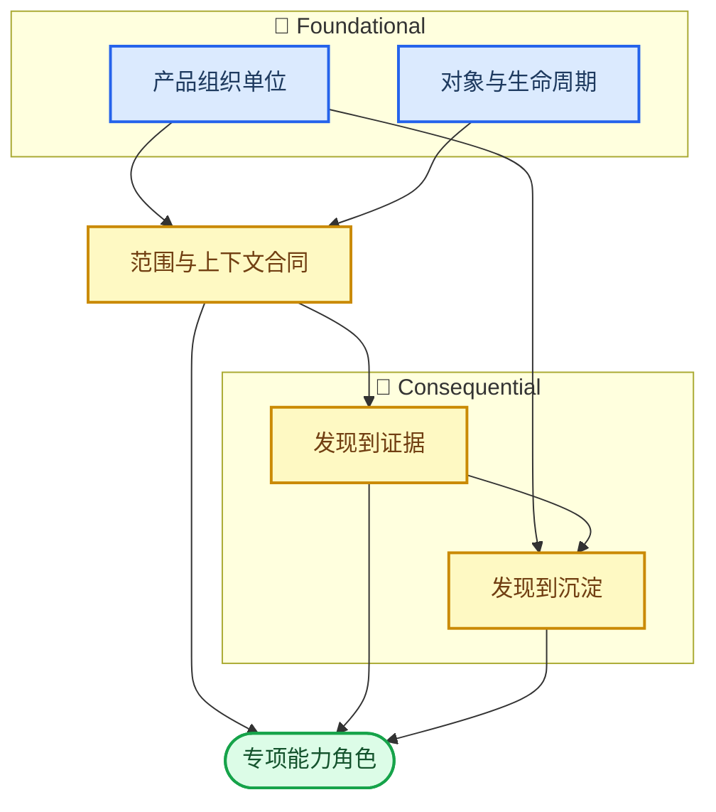

# DAK Studio Product Decision Map

_基于 2026-07-09 的产品现实、意图对照与任务走查；用途是收束问题定义，供下一轮比较产品模型，不选择模型、不设计导航、不安排实施。_

---

本地图将三份审计中反复出现的现象压缩为六个待决策张力。它不把“页面归属”“深链返回”“队伍筛选文案”等当成彼此独立的待办：这些多数是上游产品选择尚未明确时，已经在实现中显形的后果。

## 🔍 Findings clustering

### 1. 跨页分析上下文没有成为一个明确对象

- **表面症状：** 个人主页的“长枪局首死”能打开对应比赛，却不带入选手、问题或回合；回放返回后又从 `R12` 回到 `R1`。长期状态诊断离开主页后没有持续的“本次诊断”对象。队伍透镜跨专项页保留，却进入教练工作台后需要重新设置。
- **审计证据：** [03·主任务 1](./03-task-walkthrough.md#主任务-1个人复盘闭环)记录了问题、选手、回合与返回位置的连续断裂；[03·主任务 2](./03-task-walkthrough.md#主任务-2长期状态诊断)与[主任务 3](./03-task-walkthrough.md#主任务-3理解一支队伍)记录了长期诊断和队伍浏览均不能持续；[01·全局上下文与页面内选择](./01-current-product-reality.md#全局上下文与页面内选择)证明全局范围、页面内对象选择和教练角色选择目前是分层存在的。
- **是否可能同源：** 是。它们共同暴露出“哪个上下文应跨页面存在、由谁拥有、何时失效”尚未被声明为产品合同。证据深链只携带目标位置，则是这个合同缺失的一个具体表现，而不是全部原因。
- **置信度：** 高。个人、队伍、回放三条实际走查都复现了相同类型的中断。

### 2. “范围、透镜、分析主体、比较角色”被放进相似控件，却不代表同一种选择

- **表面症状：** 选择 FURIA 的 chip 外观像过滤器，但聚合范围仍是 `7/7` 场；控图页才说明它是“赛事基线上的队伍贡献”；教练工作台另行要求设置己方/对手，且不继承该队伍透镜。
- **审计证据：** [03·专项实验 A：队伍透镜](./03-task-walkthrough.md#专项实验-a队伍透镜)完整记录了预期与实际语义的差异；[02·差异记录 3](./02-intent-vs-reality.md)确认设计和实现都将队伍定义为不窄化 demo 的透镜；[01·全局上下文与页面内选择](./01-current-product-reality.md#全局上下文与页面内选择)区分了语料层与透镜层。
- **是否可能同源：** 是。问题不是单个 chip 缺少说明，而是产品尚未定义用户可感知的选择语义与跨页面继承规则：选中的队伍有时是观察对象，有时是统计透镜，有时是己方/对手角色。
- **置信度：** 高。当前实现的语义正确且明确，但用户预期与跨页行为的落差被实际实验直接证实。

### 3. “赛事”同时承担分析范围、层级集合、资源包和管理资产

- **表面症状：** `赛事`可指 CohortScope 中的一组场次、`Event → Stage → Series → Map` 的只读集合、可导入的 event package，或管理页中的资产生命周期；资料库又单独管理 demo 条目。
- **审计证据：** [03·专项实验 B：赛事对象](./03-task-walkthrough.md#专项实验-b赛事对象)列出了四个入口和四种对象含义；[01·核心对象](./01-current-product-reality.md#核心对象)与[页面职责](./01-current-product-reality.md#页面职责)分别记录了赛事包、赛事合集、资料库和管理页的职责；[02·差异记录 11](./02-intent-vs-reality.md)确认三者边界仍不清楚。
- **是否可能同源：** 是。多个入口的可发现性问题、资料库/管理重叠和赛事合集的定位，均来自同一件事：领域对象与资产生命周期的关系没有以一个一致模型暴露给用户。
- **置信度：** 高。四种含义都已在当前运行产品和实现中存在。

### 4. 产品外壳按任务分组，成熟使用却主要按分析能力进入

- **表面症状：** 一级导航已有“开始 / 选手复盘 / 赛事与队伍 / 备战”，但成熟用户仍是先进对枪、经济、道具、控图等能力页，再在页内选对象；个人主页与教练工作台更像任务闭环，却没有把相邻专项页组成持续流程。队伍也没有稳定对象页，只能在多个分析面分别观察。
- **审计证据：** [01·先选对象还是先选分析类型](./01-current-product-reality.md#先选对象还是先选分析类型)明确区分了新用户对象/数据优先与成熟用户分析类型优先；[03·主任务 2](./03-task-walkthrough.md#主任务-2长期状态诊断)和[主任务 3](./03-task-walkthrough.md#主任务-3理解一支队伍)记录了离开首页后、队伍跨专项浏览时的组织负担；[02·差异记录 2 与 4](./02-intent-vs-reality.md)记录了赛事容器化与实际入口演进。
- **是否可能同源：** 是。它们不是“导航层级太深”或“缺一个对象页”两类独立问题，而是产品到底优先组织分析能力、分析对象，还是持续任务的未决选择。
- **置信度：** 高。三份审计从产品现实、意图和任务走查给出一致信号。

### 5. 发现、证据、行动与沉淀已经各自有效，但交接没有成为统一闭环

- **表面症状：** 主页能主动提出练习问题并给证据；对枪、道具和控图能给出观察与回放；教练工作台能把模式加入清单并导出报告；但专项分析不能自然把当前发现交给备战，个人发现也不会成为可继续的诊断条目。道具点位则已能直接回放、进游戏和复制练习命令。
- **审计证据：** [03·主任务 1](./03-task-walkthrough.md#主任务-1个人复盘闭环)指出“现象→比赛证据”之间的原因链丢失；[03·主任务 4](./03-task-walkthrough.md#主任务-4对手备战)证明教练内部的“模式→回合→清单→报告”闭环已真实可用；[01·产品路径](./01-current-product-reality.md#产品路径)与[02·差异记录 5、8、9](./02-intent-vs-reality.md)共同记录了点位、控图和证据动作的不同落点。
- **是否可能同源：** 是。核心不是“再加一个加入备战按钮”，而是分析结果何时应从观察升级为可验证、可携带、可沉淀的产品对象，以及该对象需要保留哪些来源信息。
- **置信度：** 高。现有闭环和断裂点均由真实任务走查观察到。

### 6. 多个专项能力的页面归属看似不同，实为“能力在产品中扮演什么角色”未定

- **表面症状：** 道具点位库在当前导航中属于“赛事与队伍”，设计意图却偏备战素材；道具价值已从闪光扩展为雷火烟闪贡献；控图作为独立诊断页已进产品，但尚未明确是流程步骤还是终点；赛事容器把三个不同的赛事面放进 tab。
- **审计证据：** [02·差异记录 2、5、6、8](./02-intent-vs-reality.md)逐项记录了这些能力的演进与归属张力；[01·页面职责](./01-current-product-reality.md#页面职责)说明它们分别服务贡献评估、练习复现、空间诊断与赛事浏览；[03·主任务 3 与 4](./03-task-walkthrough.md#主任务-3理解一支队伍)则显示专项页和备战之间尚无统一交接。
- **是否可能同源：** 是，但它是下游聚类。各能力是否应独立存在、作为证据来源，还是作为行动素材，取决于前五项决定；不能靠逐页“搬家”解决。
- **置信度：** 中高。边界张力明确，但不同能力未必最终采用同一种产品角色。

## 📌 Root product decisions

以下六项按重要性排序。`foundational` 表示会约束对象、上下文与后续信息架构；`consequential` 表示决定闭环如何成立；`local` 表示应由上游选择推导，不能先行拍板。

| 优先级 | 决策 | 层级 |
| ---: | --- | --- |
| 1 | 产品的主要组织单位 | foundational |
| 2 | 领域对象与资产生命周期 | foundational |
| 3 | 范围、透镜与跨页上下文合同 | foundational |
| 4 | 发现到证据的上下文合同 | consequential |
| 5 | 分析结果如何进入行动与沉淀 | consequential |
| 6 | 专项能力的产品角色与归属 | local |

### D1. 产品的主要组织单位（foundational）

#### Decision

需要决定用户离开任一页面后，产品仍应让其持续看见的首要单位是什么：分析能力、被分析的人/队伍/赛事/比赛，还是一个正在推进的问题/任务。

#### Why this is a product decision

这决定页面、对象选择、导航和状态分别服务谁。仅调整侧栏或增加跳转，不能回答用户究竟应该“先找一种分析”还是“继续理解同一个人、队伍或问题”。

#### Evidence

[01·先选对象还是先选分析类型](./01-current-product-reality.md#先选对象还是先选分析类型)显示当前入口同时存在对象/数据优先和分析能力优先两种模式；[03·主任务 2](./03-task-walkthrough.md#主任务-2长期状态诊断)显示个人诊断离开主页后退回专项页；[03·主任务 3](./03-task-walkthrough.md#主任务-3理解一支队伍)显示队伍分析也主要是跨能力浏览；[02·差异记录 4](./02-intent-vs-reality.md)将其归为实际使用路径的产品选择。

#### Current implicit answer

当前已经采用“任务分组的外壳 + 分析能力为成熟入口”的混合答案：主页、比赛工作台和教练工作台提供局部任务容器，但多数跨场使用从某个专项分析能力开始，对象多在该页或全局范围内选择。

#### Tension

这种混合方式同时保留了能力发现的直接性和任务入口的价值，却要求用户自己把多个页面串成个人诊断或队伍理解；首页、教练的闭环价值因此难以延展到其它分析面。

#### Decision dimensions

- 持续上下文的 owner：能力页、分析对象，或进行中的问题/任务
- 成熟用户的主入口：先选择分析能力，或先选择要持续理解的对象/问题
- 单场比赛的地位：独立工作容器，还是其它分析结论的证据目的地

### D2. 领域对象与资产生命周期（foundational）

#### Decision

需要决定 `demo / match`、分析范围中的赛事、`Event → Stage → Series → Map` 层级、event package 和管理资产各是什么对象，以及它们如何关联、导入、可用与失效。

#### Why this is a product decision

这不是给入口重新命名的问题。不同对象决定了统计可用范围、用户能否在一个层级看到另一层级、导入是否只是技术动作，以及“赛事”能否作为可持续的分析对象。

#### Evidence

[03·专项实验 B：赛事对象](./03-task-walkthrough.md#专项实验-b赛事对象)已经把同一个词在四处代表的含义拆开；[01·核心对象](./01-current-product-reality.md#核心对象)确认了赛事既是聚合范围又是赛事包层级视图；[02·差异记录 11](./02-intent-vs-reality.md)记录了资料库、管理与赛事合集的职责重叠。

#### Current implicit answer

当前实现把这些对象分别存储和操作：资料库维护 demo，管理页处理身份和赛事资产，赛事合集读取层级化赛事记录，全局范围将事件映射为一组条目。产品界面却主要以同一个“赛事”词汇连接它们，关系需要用户自行推断。

#### Tension

技术上分离有利于资产管理和只读集合浏览；产品上却让“我选中的赛事”“我导入的赛事包”“我正在看的赛事合集”听起来像同一物，增加范围、入口和生命周期的理解成本。

#### Decision dimensions

- 是否将赛事明确为一个组合领域对象，或承认其只是若干不同对象的相邻标签
- 赛事包是分析对象的来源、对象的一个表示，还是纯技术资产
- demo/series/event 的关联是在导入时完成、在管理时维护，还是在分析时临时形成

### D3. 范围、透镜与跨页上下文合同（foundational）

#### Decision

需要决定哪些选择改变分析语料，哪些只改变观察透镜，哪些是分析主体或比较角色；并定义它们在页面、比赛工作台和备战情境之间应如何继承、覆盖或重置。

#### Why this is a product decision

这些选择会改变分母、比较基线和结论含义。无论 chip 设计得多清楚，若队伍在一个页面代表透镜、在另一个页面代表敌方角色，用户仍需要知道每种选择的语义与转移规则。

#### Evidence

[01·全局上下文与页面内选择](./01-current-product-reality.md#全局上下文与页面内选择)确认了当前语料层/透镜层的实现；[02·差异记录 3](./02-intent-vs-reality.md)确认这一行为是有意设计；[03·专项实验 A：队伍透镜](./03-task-walkthrough.md#专项实验-a队伍透镜)证明控件表象、用户预期与教练页继承规则仍不一致。

#### Current implicit answer

当前产品把赛事、地图、标签、排除场次作为语料层，把队伍作为跨场页的透镜；比赛工作台不显示全局范围；教练工作台继承可用语料，却局部建立己方/对手角色，不继承队伍透镜。

#### Tension

该模型保留了“同一批对局中看某队及其对手”的分析价值，但同一外观的选择控件和不一致的跨页行为，足以让用户按“筛选后只看这队比赛”理解它。

#### Decision dimensions

- 语料范围、观察透镜、分析主体与对手/己方角色的正式分类
- 每类选择的用户可见语义：改变样本、改变行级观察，或建立比较关系
- 每类上下文的继承、覆盖、回退与重置条件

### D4. 发现到证据的上下文合同（consequential）

#### Decision

需要决定“发现”是否拥有可传递的身份与最小上下文，使用户从结论进入比赛/回放后仍能知道正在验证什么，并能按同一语义回到来源。

#### Why this is a product decision

这不等同于加一个返回按钮。它要求定义发现、分析主体、范围、证据目标与来源之间的关系；否则深链只能证明“到了正确 tick”，不能保留“为什么这个 tick 是证据”。

#### Evidence

[03·主任务 1](./03-task-walkthrough.md#主任务-1个人复盘闭环)记录了首页问题→比赛→回放→返回的完整断裂；[01·证据汇总](./01-current-product-reality.md#d-证据汇总)确认证据入口已经跨多个页面存在；[02·差异记录 9](./02-intent-vs-reality.md)记录证据动作已扩展到比赛与游戏。当前实现的 `MatchDeepLink` 只含 `roundNumber` 与可选 `tick`，也与这一观察一致。

#### Current implicit answer

当前证据被实现为到比赛/回合/tick 的目标跳转；比赛与 2D 回放可以消费这个位置，但没有来源发现或调用方的显式状态，因此返回只能回到各自局部默认状态。

#### Tension

目标定位已经足够准确，继续把它看作纯路由问题却会遗漏个人诊断和专项发现的核心语义；反之，若每次查看证据都被过度持久化，也会把普通浏览误变成任务管理。

#### Decision dimensions

- 证据是无状态目标、带调用方上下文的跳转，还是隶属一个正式发现
- 哪些信息必须前传与回传：分析主体、问题标签、范围、排序原因、回合/tick、来源页面
- 哪些证据访问需要可回溯闭环，哪些可保持普通的单向浏览

### D5. 分析结果如何进入行动与沉淀（consequential）

#### Decision

需要决定一个分析结果何时应从“观察”升级为可行动、可保存、可复用或可导出的条目，以及这种沉淀与已有备战能力的关系。

#### Why this is a product decision

它决定产品产物是什么，而不仅是某处是否显示“加入”按钮。需要先界定哪些发现值得被保存、保存的 provenance 和使用场景，以及专项分析对行动层的交接责任。

#### Evidence

[03·主任务 4](./03-task-walkthrough.md#主任务-4对手备战)验证了教练工作台内部的模式、代表回合、清单和报告闭环；[03·主任务 3](./03-task-walkthrough.md#主任务-3理解一支队伍)指出经济、对枪、道具和控图发现无法自然带入该闭环；[03·主任务 1](./03-task-walkthrough.md#主任务-1个人复盘闭环)说明个人问题也未成为可继续处理的条目；[02·差异记录 5 与 9](./02-intent-vs-reality.md)则显示点位已形成练习复现动作。

#### Current implicit answer

当前产品隐式把教练工作台作为备战条目和报告的本地容器；其它分析页主要负责观察与证据跳转。道具点位库例外地同时提供回放、进游戏与练习命令。

#### Tension

教练闭环已经证明“行动与沉淀”有价值，但若它只接收本页生成的模式，其他有效发现只能停在数据页；若所有观察都可沉淀，又会混淆临时探索与真正可执行的结论。

#### Decision dimensions

- 允许升级为行动条目的发现类型与最低证据要求
- 沉淀是局部页面内收藏，还是跨分析能力可识别的产品对象
- 条目需保留的来源、范围、证据、说明和导出语义

### D6. 专项能力的产品角色与归属（local）

#### Decision

在前五项明确后，需要逐项决定道具价值、道具点位、控图、赛事容器等能力是独立分析面、某个闭环的证据步骤、可复用行动素材，还是确实需要同时承担多种角色。

#### Why this is a product decision

这里讨论的不是把某页移到哪一组，而是能力对用户任务的承诺。只有先知道产品组织单位、上下文合同和行动对象，才能判断某项能力的独立入口是否合理。

#### Evidence

[02·差异记录 5、6、8](./02-intent-vs-reality.md)分别记录了点位库、道具价值和控图的角色张力；[01·页面职责](./01-current-product-reality.md#页面职责)表明它们回答的是不同问题；[03·主任务 3 与 4](./03-task-walkthrough.md#主任务-3理解一支队伍)显示专项观察与备战沉淀的交接尚未建立。`DuelView` 的共用实现则已被 [02·差异记录 7](./02-intent-vs-reality.md)归为低优先级实现复用，不应升级为产品结构问题。

#### Current implicit answer

当前把大多数能力作为直接可进入的分析页；赛事相关内容使用容器 tab；控图独立存在；点位库虽然具备练习动作，仍放在赛事与队伍组。不同能力已按真实压力演进，但尚未共享一个清晰的角色判断标准。

#### Tension

逐页调整归属能够暂时改善可发现性，却可能反复改变入口而不改变用户任务；反过来，强行让所有能力采用一种角色，也会抹平贡献评估、空间诊断和练习复现之间的真实差异。

#### Decision dimensions

- 每项能力的首要用户问题与证据/行动产出
- 它在产品中是独立目的地、流程中的一步，还是具备明确边界的双重角色
- 能力边界、命名与入口在何时由上述角色推导，而非先行决定

## 🔗 Dependency map

`D1` 与 `D2` 是必须先共同比较的上游选择：若产品要让对象或任务持续存在，必须先知道对象究竟是什么；若保持能力优先，也仍需明确赛事等对象的可用边界。`D3` 把对象关系落实为每次分析的可解释状态。此后才能讨论证据闭环、行动沉淀，以及单项能力的归属。

### Upstream decisions

- `D1 + D2`：决定产品首先延续什么，以及人、队伍、比赛、赛事、资源包是否能支撑这种延续
- `D3`：在既定对象上决定哪些选择改变语料、哪些表达观察/比较关系，及其跨页规则
- `D4`：在既定上下文合同上决定发现与证据如何前后关联

### Downstream decisions

- `D5` 依赖 `D1` 对任务的定义和 `D4` 的证据/provenance 语义，才能界定哪些发现值得行动化
- `D6` 依赖 `D1`、`D3`、`D4`、`D5`，才能判断点位、控图、道具价值、赛事容器等的产品角色
- 具体导航、页面合并/拆分、控件文案和按钮位置均是 `D6` 的后果，不是该图的起点

### 可以独立处理的问题

- `DuelView` 为两个产品面复用同一实现，是实现层复用；除非重新定义两面的用户任务，不需要作为本轮产品决定
- 设计文档中已经落地的导航/能力状态可单独同步；这不会替代任何一项上游选择
- 控图的性能、缓存与统计口径验证可继续作为工程/数据质量工作，只要不预设它最终是独立目的地还是流程步骤
- 已有深链的回合/tick 定位是否正确可以单独测试；“应该带着什么语义返回”仍须等待 `D4`

## 🚫 What NOT to decide yet

| 当前不应讨论的事项 | 它依赖的上游决定 | 原因 |
| --- | --- | --- |
| 具体侧栏文案、分组名、图标与排序 | `D1`、`D6` | 这些是组织单位与能力角色的表达，不应反向决定模型 |
| “赛事与队伍”是否拆成多个入口、tab 如何排列 | `D1`、`D2`、`D6` | 先要知道赛事对象及各能力的产品角色 |
| 具体卡片、表格、雷达或 2D 回放的样式 | `D4`、`D6` | 呈现方式取决于它在证据链中的任务，而不是反过来 |
| 队伍 chip 的文案、颜色、tooltip 和重置按钮 | `D3` | 必须先确定它究竟是范围、透镜、主体还是比较角色 |
| 证据按钮放左还是右、命名为“回放”还是“查看证据” | `D4` | 先决定按钮交付的是目标跳转、上下文跳转还是发现闭环 |
| 教练工作台的 tab、入口位置与最终角色 | `D5`、`D6` | 先界定行动/沉淀由哪些发现触发，再讨论承载形态 |
| 道具点位库、控图、道具价值的页面搬迁或组件拆分 | `D5`、`D6` | 这些能力的角色尚未由上游决定推导出来 |
| 战术板是否成为一个入口及其界面形态 | `D5`、`D6` | 先判断它服务何种行动产物、接受哪些来源发现 |

> ⚠️ **边界：** 以上项目不是“不重要”，而是现在讨论会把隐含产品模型伪装成视觉或路由选择。它们应在上游张力比较后自然收敛。

## 📋 下一轮应比较的竞争性产品模型

下一轮不需要再调查全部仓库。应围绕下表的差异建立 2–3 个可竞争模型，并对同一组审计任务逐一检验；它们是比较框架，不是本地图推荐的方案。

| 模型焦点 | 核心差异 | 必须回答的检验问题 |
| --- | --- | --- |
| 分析能力优先 | 能力页是稳定起点，对象主要作为范围/局部选择 | 如何让当前人、队伍或发现跨能力保持可解释，而不把每页变成孤岛？ |
| 分析对象优先 | 人、队伍、赛事或比赛是持续上下文，能力是观察方式 | `D2` 的对象与生命周期能否支持这种延续，范围和比较角色如何不混淆？ |
| 发现/任务闭环优先 | 一个待验证的问题或备战发现组织证据、分析与沉淀 | 哪些探索值得成为任务，如何避免把普通浏览变成繁重的项目管理？ |

比较时应优先用三条已走查路径验证：个人“发现问题→证据→回到问题”、队伍“选择对象→跨分析理解”、对手“分析发现→行动沉淀”。若某模型无法同时解释赛事资产生命周期和队伍透镜语义，就不能仅凭导航观感胜出。

> 📌 **本轮结论：** 问题定义到此结束。下一轮的工作不是细化页面，而是在六项决策的依赖约束下，比较这些模型对同一现实证据的解释力与代价。
