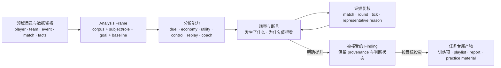

# DAK Studio 产品模型综合与选择

评审日期：2026-07-11  
证据优先级：`01-current-product-reality.md`、`02-intent-vs-reality.md`、`03-task-walkthrough.md` 为主要事实；`04-product-decision-map.md` 与 `04b-adversarial-review.md` 仅作为待裁决的问题定义。  
边界：本稿只选择产品模型，不设计具体 UI、导航文案、页面布局或实施 roadmap。

## 0. 结论先行

04 找对了主要断裂：范围与角色混淆、赛事多义、发现无法持续、专项分析与行动沉淀脱节。04b 对 04 的三项核心攻击成立：

1. “对象 / 能力 / 任务”不是天然互斥的全产品模型，它们首先属于不同产品层级；
2. 用户领域对象与 ZIP/package/import 等资产运营不应合并成一个 ontology；
3. “发现到证据”和“发现到行动”不是两个根决策，而是同一个发现生命周期。

但 04b 的五项反方 Root Decision 仍不是最小集合。`Actor / Subject / Role / Goal`、`Analysis Domain / Data Eligibility` 都是在定义一次分析的输入语义；`Claim / Evidence Validity` 与 `Finding Lifecycle` 都是在定义一次分析的知识产物；`Cross-boundary Continuity` 则取决于前两者由谁持有。继续把它们平铺为五个根问题，会把同一条输入—分析—产出链拆得过细。

本稿裁决后，只保留三个 Root Decision：

| Root Decision | 要决定的根问题 | 推荐答案 |
|---|---|---|
| **R1 · Analysis Frame** | 哪些坐标共同决定“一次分析正在分析什么、为谁、为什么、以什么样本和基线成立”？ | 用显式的分析框架统一语料、主体/关系、目标、基线、资格与 provenance |
| **R2 · Claim–Evidence–Finding Lifecycle** | 系统产出的观察何时成为可解释断言、可复核发现和行动材料？ | 采用“观察 → 断言 → 复核 → 接受/否决 → 可选行动化”的生命周期；不是每个观察都持久化 |
| **R3 · Work Ownership** | 工具、对象、任务还是别的容器，拥有一次进行中的分析及其跨能力连续性？ | 由 Analysis Frame 拥有当前分析；能力只消费框架，领域目录只提供输入，Finding 只在升级后持久化 |

基于这三个决定，推荐的产品模型是：

> **Analysis Frame Workbench（分析框架工作台）**：一次分析由“语料 + 主体/关系 + 目标 + 基线/分母 + 数据资格”定义；对枪、经济、道具、控图、回放、教练分析是可复用工具；只有被表述且值得继续处理的观察才升级为 Finding，再投影成个人训练项、备战清单、报告或练习素材。

它不是“对象优先 + 能力优先 + 任务优先”三套入口的叠加。它只有一条所有权规则：**Analysis Frame 拥有进行中的分析，能力不拥有上下文，Finding 不拥有未被提升的普通浏览，资产包不拥有用户领域语义。**

## 1. 证据重新压缩：真正缺失的不是页面，而是中间层

01–03 描述的全部有效与失效路径，可以压缩为同一条产品链：

当前产品并非从零缺少这些层，而是每一层都已有局部雏形：

- `CohortScope` 已经是 Analysis Frame 的一部分：它区分窄化 demo 的语料层与不改变语料的队伍透镜。[01·全局上下文](./01-current-product-reality.md#全局上下文与页面内选择)
- “这是我”、当前选手、FURIA 透镜、教练页的己方/对手，是主体与关系的局部表达，但没有共同的目标与继承合同。[03·队伍透镜实验](./03-task-walkthrough.md#专项实验-a队伍透镜)
- 首页“本周该练什么”已经生成带指标与单条证据的断言雏形；比赛工作台和回放能解析证据位置，却不知道用户为何而来。[03·个人复盘闭环](./03-task-walkthrough.md#主任务-1个人复盘闭环)
- 教练工作台已有 `pattern → representative round → playlist → report` 的局部生命周期，证明沉淀并非理论需求。[03·对手备战](./03-task-walkthrough.md#主任务-4对手备战)
- 对枪、经济、道具、控图都是真实有效的能力，不应因为上层缺少连续性就被重写为一个大而全对象页。[01·页面职责](./01-current-product-reality.md#b-页面职责)

因此，前几轮审计最容易遗漏的结构是：

> 用户不是在“页面、对象、任务”之间选择一种世界观，而是在把**数据域**构造成一次有目的的**分析框架**，使用若干**能力**形成可解释断言，再选择是否把断言提升成可持续的**知识/行动产物**。

这四层可以采用不同组织原则，但每层必须只有一个清晰职责，不能让相同状态在多层重复拥有。

## 2. 定向现实核验

本轮没有重新全面审计仓库，只核验了会改变 04/04b 裁决的接缝：

| 核验点 | 当前现实 | 对产品模型的含义 |
|---|---|---|
| App 状态 | `view`、`selectedDemoId`、`selectedPlayerKey`、`scope`、`matchDeepLink` 分别存放；`MatchDeepLink` 只含 round/tick | 当前有若干位置状态，没有一个拥有完整分析语义的容器 |
| CohortScope | event/map/tag/excludedIds 窄化 corpus；team 只筛 facts 行 | “选 FURIA”不能只用一个泛化 selection 表达，必须区分语料、主体和基线 |
| 首页建议 | `PracticeCard` 只有 label、count、单条 evidence target | 首页已有 claim 雏形，但没有 claim identity、证据理由或复核状态 |
| 教练角色 | `mode + myTeamName/opponentTeamName` 派生 subjectTeam，跨当前语料聚合 | 对手备战天然是“关系 + 目标”的分析，不只是一个 team object |
| 备战清单 | `PlaylistItem` 保存 group、match、round、cluster/fingerprint、note，并可导出 Markdown | 局部 Finding/Action 已真实存在，但合同是教练专属，不能直接假定为全局万能对象 |
| Event Package | Event/Series 是用户组织层；package/R2/import 是其数据来源与可用性机制 | Event 可以进入领域模型，package 应留在数据供应与 readiness 层 |
| Git 演进 | 全局范围、主页编排、教练闭环、证据进游戏等能力分别在真实压力下逐步加入 | 断裂来自独立能力缺少共同上层合同，不证明现有有效能力需要被推翻 |

相关实现与设计接缝：[`App.tsx`](../../../apps/dak-studio/src/App.tsx)、[`CohortScope.tsx`](../../../apps/dak-studio/src/components/CohortScope.tsx)、[`HomeView.tsx`](../../../apps/dak-studio/src/views/HomeView.tsx)、[`playlist.ts`](../../../apps/dak-studio/src/lib/playlist.ts)、[`CoachView.tsx`](../../../apps/dak-studio/src/views/CoachView.tsx)、[studio-redesign.md](../../design/studio-redesign.md)、[event-packages.md](../../design/event-packages.md)。

## 3. 对 04 与 04b 的逐项裁决

### 3.1 04：保留事实压缩，重写决策结构

| 04 项目 | 裁决 | 去向 |
|---|---|---|
| D1 产品的主要组织单位 | **拆分并重写** | 不再问全产品唯一单位；把“谁拥有进行中的分析”交给 R3，把各层组织原则分别处理 |
| D2 领域对象与资产生命周期 | **拆分、部分降级** | 用户可感知对象、分析范围与数据资格进入 R1；package/import/storage/repair 留在供应与运营层 |
| D3 范围、透镜与跨页上下文 | **保留语义核心、拆出行为后果** | corpus/lens/subject/role/baseline 进入 R1；继承、返回、重置由 R3 推导；chip 表达是下游 UX |
| D4 发现到证据 | **与 D5 合并** | 进入 R2 的完整生命周期 |
| D5 结果进入行动与沉淀 | **与 D4 合并** | 行动是 Finding 被接受后的任务专属投影，不是独立的全局 sink |
| D6 专项能力角色与归属 | **降级并按能力拆开** | 能力产出合同由 R1/R2 约束；独立入口、页面归属和复用方式是下游产品/UX 决策 |

04 的 dependency map 也需要改写。不是 `D1/D2 → D3 → D4 → D5 → D6` 的单链，而是：

- R1 定义分析输入与结论口径；
- R2 定义分析输出与证据有效性；
- R3 决定谁在两者之间拥有连续性；
- 导航、页面、deep link、控件和专项能力归属共同成为 R3 的下游表达。

### 3.2 04b：核心攻击成立，但五项根问题仍可继续压缩

| 04b 项目 | 裁决 | 原因 |
|---|---|---|
| Actor / Subject / Role / Goal | **保留，合入 R1** | 它是 Analysis Frame 的关系与目的坐标，不需要另立对象体系 |
| Claim / Evidence Validity | **保留，合入 R2** | 证据有效性必须与断言生命周期同时定义；否则只有位置跳转，没有可验证知识 |
| Analysis Domain / Data Eligibility | **保留用户可见部分，合入 R1** | corpus、denominator、coverage、provenance 是分析语义；下载/import mechanics 不是根产品模型 |
| Finding Lifecycle | **保留，合入 R2** | 与 claim/evidence validity 是同一个产物从生成到接受/行动化的生命周期 |
| Cross-boundary Continuity | **降为 R3 的验收合同** | 先知道谁拥有 frame/finding，才能判断何时继承、rebind、返回或重置 |

### 3.3 两份问题定义共同遗漏的三个关键区分

#### A. 分析主体不总是领域对象，而可能是“关系”

个人复盘可以近似 `subject = self`，队伍理解可以近似 `subject = FURIA`；但对手备战不是“打开 FURIA 对象”就能表达。它至少包含受益方/视角方、被研究对手、关系角色和目标。相同 FURIA 在中立赛事分析、己方复盘、敌方侦察中，结论含义不同。

因此，对象页可以是入口或目录，却不足以成为所有分析的语义 owner。

#### B. 当前分析状态与持久化 Finding 不是同一种东西

04 容易把“任务组织”与 finding/action 混在一起，04b 又倾向把 Finding 提升为普遍一等对象。两者都缺少一个阈值：

- 普通探索可以只有临时 Analysis Frame，不应强迫命名、保存或管理；
- 系统生成的指标/模式首先只是 observation 或 candidate claim；
- 只有当用户要复核、接受、否决、继续追踪或行动化时，它才应升级为 Finding；
- 被接受的 Finding 再按目标投影成训练项、备战清单、报告或练习素材，而不是进入一个万能收藏箱。

这个区分是避免“任务优先模型”退化成繁重项目管理的关键。

#### C. Data readiness 是分析资格，不等于资产运营

用户不需要理解 package slug、R2 路径或导入内部步骤，但必须知道当前结论用了哪些比赛、覆盖是否完整、分母是什么、证据是否可播放、facts 是否具备所需分析资格。

因此：

- Event / Series / Match 属于用户领域目录；
- package、download、local availability、facts rebuild 属于数据供应；
- coverage、denominator、provenance、可用分析类型是两者之间的用户可见资格合同；
- Library / Management 如何分工仍重要，但不是本轮产品模型的 Root Decision。

## 4. 最小 Root Decision Set

### R1. Analysis Frame：一次分析由哪些语义坐标定义？

#### 决策

一次跨场或单场分析不能只由“当前页面 + 若干筛选值”隐式定义。它至少需要明确以下坐标：

- **Corpus**：哪些 event / series / match / round 构成分析语料；
- **Actor / Beneficiary**：谁在使用结论、为谁做分析；
- **Subject / Relationship / Role**：分析谁，或分析哪组关系；
- **Goal**：个人诊断、队伍理解、中立赛事分析、己方复盘、对手备战等目的；
- **Baseline / Denominator**：与谁比、以什么样本为分母；
- **Eligibility / Provenance**：数据覆盖、facts/回放资格、来源与缺失。

这些坐标不要求用同一个控件或同一层级展示；它们只是共同决定一个结论是否有明确含义。

#### 为什么是根决策

`FURIA + 7/7 场` 可以合理表示“在全部对局基线上看 FURIA 的贡献”，也可以表示“只看 FURIA 参赛场次”。如果没有 Analysis Frame，两者只能靠页面内部惯例区分。个人“这是我”、赛事范围与教练 self/opponent 也会继续成为彼此不兼容的 selector。

#### 本决策不包含

chip 样式、顶栏形式、URL 参数、页面局部筛选、package 导入流程、Library/Management 操作归属。

### R2. Claim–Evidence–Finding Lifecycle：系统如何把数据变成可信且可行动的知识？

#### 决策

产品需要区分五种状态，而不是把所有指标都叫“发现”：

1. **Observation**：统计、排名、模式、回合或空间信号；
2. **Claim**：对 observation 的可理解断言，说明“发生了什么、为何值得关注”；
3. **Evidence Review**：用户进入具体 match/round/tick，知道这段证据支持或反驳什么；
4. **Finding**：经用户或明确规则接受、否决、标注或保存的判断，保留 frame、claim、evidence reason 与 provenance；
5. **Action Projection**：按任务投影成训练项、playlist、报告、战术/练习素材；不同目标可以有不同投影，不建立万能 sink。

#### 为什么是根决策

03 的个人路径失败，并不只是 R12 没传到比赛页，而是用户到达 R12 后不知道系统希望验证哪段行为、为何它代表“长枪局首死”问题。教练路径之所以成功，也不是因为多了一个“加入”按钮，而是 pattern、代表回合、清单和报告在局部共享了同一材料身份。

#### 本决策不包含

具体 deep-link 字段、返回按钮位置、保存控件、报告版式、自动生成阈值或数据 schema。

### R3. Work Ownership：谁拥有一次进行中的分析？

#### 决策

必须在以下候选 owner 中选择一个，作为跨能力连续性的唯一来源：

- 某项分析能力；
- 某个 player/team/event/match 对象工作空间；
- 一个显式持久化 case/brief；
- 一个可临时存在、必要时再保存的 Analysis Frame。

推荐选择最后一项。对象目录负责供选择，能力负责分析，Finding 负责已提升的知识，均不重复拥有当前 session。

#### 为什么是根决策

仅定义 R1/R2 而不指定 owner，会得到一套漂亮 ontology，却仍不知道用户从经济进入回放、从控图进入备战、从首页进入比赛时，谁负责保留并恢复上下文。反过来，先写跨页继承规则而没有 R1/R2，只会继续传递含义不清的 selector 和 route state。

#### 本决策不包含

一级导航结构、对象页数量、是否使用 tab、浏览器 history、页面合并拆分和具体持久化机制。

## 5. 所谓“竞争模型”究竟在哪一层竞争

04 的“能力优先 / 对象优先 / 发现任务优先”只有在回答同一个问题——**谁拥有一次进行中的分析**——时才是真竞争。放到整个产品中，它们更适合作为不同层的原则：

| 产品层 | 最自然的组织原则 | 不应承担的职责 |
|---|---|---|
| 领域目录与数据供应 | **对象优先**：player/team/event/series/match、资产可用性与组织关系 | 不拥有当前分析目标，不把 package 当用户分析对象 |
| 当前分析 session | **需要选择真正的竞争模型** | 不能同时让 page、object、case 各保存一套 current context |
| 分析能力 | **能力优先**：对枪、经济、道具、控图、回放等可直接调用和复用 | 不定义主体关系，不自行发明 scope，不自动持久化所有观察 |
| 知识与行动 | **Finding/任务优先**，但只在 observation 被提升之后 | 不把普通探索变成待办管理，不建立无语义的万能收藏 |

因此，本轮不会比较“整个产品是否按对象或能力组织”，而是比较四种真正不同的 session-owner 模型。

## 6. 四个可落地的产品模型

### 模型 A：Capability Console（能力控制台）

**唯一规则：能力页拥有当前工作；对象和范围是共享 sidecar，Finding 是可选书签。**

用户直接进入对枪、经济、道具、控图等能力，设置范围和对象，在能力内部完成探索；证据跳到比赛/回放，再尽可能恢复调用方状态。现有 DAK Studio 最接近这一模型。

它不是“不改现状”。要使其自洽，仍需让每项能力声明自己如何解释 corpus、subject、baseline 和输出，并建立可靠的调用方恢复。但它不要求一个跨能力的统一分析容器。

适合：高频使用某个工具、知道自己要查什么的专家。  
核心风险：个人长期诊断和队伍理解仍由用户手工拼接；跨能力 Finding 很容易退化为普通收藏。

### 模型 B：Domain Portfolio（领域对象工作空间）

**唯一规则：player、team、event、match 等对象拥有当前工作；能力是对象的分析视图。**

用户先进入某个对象，再从不同分析能力观察它。数据范围、历史、证据与导出都归属于该对象；比较关系作为对象工作空间中的附加上下文。

适合：长期理解同一个人、队伍或赛事；对象档案天然可积累。  
核心风险：对手备战是 `beneficiary team × opponent team × goal` 的关系任务，不自然归属于任一单对象；同一 FURIA 在中立赛事分析与敌方侦察中的语义也不同。为了容纳这些关系，模型容易不断发明复合对象或复制能力。

### 模型 C：Mission Casefile（任务卷宗）

**唯一规则：一个明确目标的持久化 case/brief 拥有当前工作；对象、范围、能力和 Finding 全部归档其中。**

个人状态诊断、队伍分析、赛事研究、对手备战都先成为一个 case；工具产生的观察与证据进入 case，经复核后形成行动或报告。

适合：有明确交付物、多人复核或需要长期回溯的分析。Coach 当前的备战清单/报告最接近这个模型。  
核心风险：用户只是想快速看一项指标或浏览赛事时，也被迫创建、命名、管理任务；产品会从分析工作台滑向项目管理系统。

### 模型 D：Analysis Frame Workbench（分析框架工作台）

**唯一规则：一个可临时存在的 Analysis Frame 拥有当前工作；能力消费它，只有被提升的 Finding 才持久化。**

Frame 可以由不同入口自然形成：

- 从“这是我”形成个人近期诊断 frame；
- 从 FURIA 形成队伍理解 frame，同时保留赛事基线与 denominator；
- 从 Event 形成中立赛事分析 frame；
- 从 Vitality vs FURIA + 敌方侦察形成对手备战 frame；
- 从单场证据进入时形成受限的 match/round frame。

能力不是 frame 的子页面定义，而是对 frame 可调用的分析器。用户可以快速探索而不创建 case；当某个 claim 值得复核或行动化时，再把它提升为 Finding。需要持续交付物的场景可以把 frame 保存为 brief，但保存不是所有浏览的前置条件。

适合：既有快速专家探索，又有跨能力诊断和少量高价值沉淀的本地分析产品。  
核心风险：Frame 若只在内部存在、用户无法感知其语义，会变成另一套隐形全局状态；若允许每项能力私自改写 frame，又会重现当前 selector 混乱。

## 7. 用 01–03 的真实任务逐一压力测试

图例：`强` = 模型天然支持；`中` = 可支持但需要额外结构；`弱` = 与模型主规则冲突。

| 真实任务 | A 能力控制台 | B 对象工作空间 | C 任务卷宗 | D 分析框架工作台 |
|---|---|---|---|---|
| **T1 个人发现 → R12 → 回放 → 回到问题** | **中偏弱**：可修调用方恢复，但 claim 仍隶属首页，跨能力身份薄弱 | **中**：player 保持不丢，但“为什么 R12 支持这个问题”仍需额外 Finding 合同 | **强**：诊断 case 天然保留 claim/evidence/status，但对一次轻量复盘偏重 | **强**：self/recent corpus/goal 随 frame，claim 复核后可选提升，不强迫建 case |
| **T2 “我最近状态不好，为什么”长期诊断** | **弱**：用户继续手工串档案、动线、对枪 | **强**：player workspace 是自然 owner | **中**：可完整诊断，但每次状态查看都任务化 | **强**：个人诊断 frame 跨能力，必要时才保存 Finding |
| **T3 理解 FURIA 的整体、经济、对枪、道具、控图** | **中**：能力直达高效，仍缺统一画像与问题排序 | **强**：team workspace 天然承接多种视图 | **中**：正式 scouting case 合适，普通了解偏重 | **强**：subject=FURIA、corpus=7/7、baseline=全局可同时成立，能力间不丢语义 |
| **T4 中立赛事分析与 Event 生命周期理解** | **中**：跨能力容易，event/asset 关系仍需旁路解释 | **强**：Event/Stage/Series/Match 目录清楚，但 package readiness 仍需另层 | **弱**：浏览赛事集合不天然是任务 | **强**：Event 供给 corpus，package 只供给 readiness/provenance；分析可临时也可保存 |
| **T5 Vitality 为己方、FURIA 为对手的备战** | **弱**：外部经济/对枪/控图发现很难交给 Coach | **中**：两个 team object 无法单独拥有这段关系，需要复合 workspace | **强**：明确 brief、证据、playlist、report 正是它的强项 | **强**：关系/目标属于 frame；Coach 可把 frame/Findings 保存成 brief 与任务专属产物 |
| **T6 普通探索与高价值沉淀并存** | **强探索 / 弱沉淀** | **中**：对象收藏容易，但 Finding 与 action 需另建 | **弱探索 / 强沉淀** | **强**：默认 ephemeral，只有明确提升后才进入生命周期 |

### 7.1 个人复盘

01–03 证明首页最强的价值不是“展示 player profile”，而是主动提出一个有指标和证据的练习 claim。A 模型只能补跳转，B 模型能保住 FalleN，却仍不能解释 claim；C 模型能完整保存，但会要求用户先接受“我在做一个项目”。D 模型允许首页直接形成 `self + recent corpus + personal diagnosis` frame，R12 证据仍知道自己在验证“长枪局首死”，用户返回后再决定是否把它提升为训练 Finding。

这不是把首页改成任务系统，而是让首页产生的 claim 不再在离开页面时失去语义。

### 7.2 长期状态诊断

B 与 D 都明显优于 A。区别在于 B 假设“FalleN”本身足以拥有分析；D 还保留“最近状态为何下降”这一目标及所用 corpus/baseline。相同 player 在长期画像、单场复盘、与某对手的比较中需要不同 frame，因此 D 对多任务复用更稳。

### 7.3 队伍分析

03 中 FURIA 的真实问题不是选不中，而是 `7/7 corpus`、`FURIA lens/subject` 和各页局部解释没有组成可感知的共同分析。B 可以用 team workspace 收住它；D 则进一步允许“中立理解 FURIA”和“把 FURIA 当对手侦察”共享 team 身份但不共享关系/目标。

这正是对象层与分析层不应合并的证据。

### 7.4 赛事分析

赛事是最能检验模型是否被现有实现绑架的场景。Event/Stage/Series/Match 应作为领域目录真实存在；event package、R2 下载与本地 facts 则决定 readiness。用户分析一个 Event 时，frame 引用领域范围和 coverage，而不是把 package 当成 session owner。

B 与 D 都可成立；D 的优势是 Event 可以只是 corpus，也可以成为中立 subject，而不要求所有赛事浏览都进入一个厚重对象工作空间。

### 7.5 对手备战

Coach 已证明 C 模型在局部有效：明确目的、关系角色、代表证据、清单与报告共同闭环。但 03 同时证明它没有接住外部专项分析。D 不推翻 Coach 的有效闭环，而是把它解释成一个**可保存的特殊 Analysis Frame**：外部对枪、经济、道具、控图工具可以在同一 frame 下产出 claim；被接受的 Finding 再按备战目标投影到 playlist/report。

这比把整个产品都改成 casefile 更符合证据：只有 Coach 路径证明了持久化任务的稳定价值，普通队伍与赛事探索尚未证明需要同等重量。

## 8. 收益、代价、复杂度与迁移风险

| 模型 | 主要收益 | 主要代价 | 概念复杂度 | 对现有实现的迁移风险 | 对已验证工作流的保护 |
|---|---|---|---|---|---|
| A 能力控制台 | 专家直达、最接近现状、局部改进快 | 继续依赖用户手工拼接，难形成可信 Finding | 低 | **低** | 高；但个人/队伍断裂只被缓解 |
| B 对象工作空间 | 个人、队伍、赛事的长期画像自然 | 关系型任务与多目标比较不断引入复合对象；能力可能重复嵌入 | 中 | **高**：会牵动大量现有能力入口与状态 owner | 中；Coach 需要重新归属 |
| C 任务卷宗 | 证据、复核、行动、报告最完整 | 普通浏览成本高，容易产品管理化 | 高 | **高**：所有入口都要围绕 case 重构 | Coach 高；其它轻量探索低 |
| D 分析框架工作台 | 同时支持快速探索、关系型分析、跨能力连续性和选择性沉淀 | 必须严格定义 frame ownership 与 observation→Finding 阈值 | 中高 | **中**：可保留能力与现有局部闭环，但上下文/产物合同要统一 | **最高**：保留 capability 直达和 Coach 闭环 |

迁移风险只比较产品模型对现有结构的扰动，不构成实施计划。

## 9. 推荐方案：Analysis Frame Workbench

### 9.1 推荐理由不是“折中”，而是证据的最短解释

推荐 D，不是因为它能容纳最多概念，而是因为它用最少的所有权规则解释了最多事实：

1. **四条任务的差异首先是 frame 差异。** 个人复盘是 self + recent corpus + diagnosis；队伍分析是 subject team + cohort baseline；赛事分析是 event corpus + neutral goal；备战是 beneficiary × opponent + scouting goal。单一对象或单一能力都不能完整表达。
2. **现有最有效的局部能力无需重做。** CohortScope 已提供 corpus 雏形，能力页已提供真实分析价值，Match/Replay 已是证据 resolver，Coach 已有可保存产物。缺的是它们之间共同认可的 frame 与 finding，而不是更多页面。
3. **它解释了为什么“竞争模型”属于不同层级。** 对象适合目录，能力适合工具层，Finding/任务适合被提升后的知识层；只有 session owner 需要真正单选。
4. **它能保护两种相反但都真实的行为。** 专家仍可直接进入能力并即时形成临时 frame；需要闭环的用户可以把 claim 提升为 Finding 或把 frame 保存成 brief。无需让所有人先建项目，也无需让所有能力退居对象页内部。
5. **它能切断 Event 与资产运营的错误耦合。** Event/Series/Match 供 frame 定义 corpus，package 只决定 readiness/provenance；资料库与管理的具体分工不再反向决定赛事分析模型。

### 9.2 推荐方案下的三项明确裁决

#### 对 R1

采用显式 Analysis Frame 作为分析语义合同。队伍不再只有一个含糊 selection：它可以是 corpus 条件、subject、comparison baseline、beneficiary 或 opponent role；具体含义由 frame 声明。

#### 对 R2

采用有阈值的 Claim–Evidence–Finding lifecycle。系统可以大量生成 observation，但只有带可解释 claim 与 evidence reason、且被用户继续处理的内容才成为 Finding。行动产物按个人训练、备战、报告、练习复现分别投影，不创建万能收藏对象。

#### 对 R3

由 Analysis Frame 唯一拥有当前 session。领域对象不复制 session，能力不私存另一套 scope/subject，Evidence 不只携带位置，持久化 case 也只是被保存的 frame，而不是所有使用的前置入口。

### 9.3 防止推荐方案退化成“把所有好想法叠在一起”的硬边界

- **不建立全产品统一的大对象主页。** player/team/event/match 继续是领域目录与可进入对象，但不自动成为所有任务的 workspace owner。
- **不把每次浏览变成任务。** Frame 默认可以临时存在；Finding 和 brief 必须经过明确提升。
- **不让所有上下文无条件跨页继承。** 继承的是 frame 语义；进入新目标时可以明确 rebind 角色。Coach 不继承 FURIA lens 本身未必是错，静默丢失或含义不明才是错。
- **不建立统一 action sink。** 个人训练、对手 playlist、报告、lineup 练习保留不同产物合同，共享的是 Finding provenance，不是同一个容器。
- **不让能力页重新定义 corpus/subject。** 能力可以增加局部参数，但必须声明它是在细化 frame，还是只改变呈现。
- **不把 package/import/storage 暴露成分析对象。** 用户只需看到 readiness、coverage、provenance 和可修复状态。
- **不从本稿直接推出导航或页面合并。** 同一个产品模型可以有多种 IA；本轮只选择 ownership 与 handoff 规则。

### 9.4 什么证据会推翻本推荐

推荐 D 仍是可证伪的：

- 如果真实高频用户绝大多数 session 都只使用单一能力，且几乎不需要跨能力保留主体、目标或 Finding，A 的低复杂度更优；
- 如果用户长期围绕单一 player/team/event 工作，关系型任务和目标切换极少，B 会比 frame 模型更直观；
- 如果产品价值最终主要来自正式备战与报告交付，普通探索只是辅助手段，C 的 casefile 模型可能应成为 session owner；
- 如果无法给 observation→Finding 建立清楚阈值，D 会退化成隐形全局状态加万能收藏，应被否决。

现有 01–03 证据不支持上述任一替代条件已经成立。相反，它同时证明了能力直达的真实价值、对象连续性的缺口、Coach 持久化闭环的局部价值，以及普通探索不应全部任务化。因此 D 是当前证据下解释力最高、对有效工作流破坏最小的选择。

## 10. 由根决策自然降级的后续问题

以下问题仍需未来处理，但不再属于产品模型 Root Decision：

| 问题 | 正确层级 |
|---|---|
| 首页到比赛是否带 R12、返回是否恢复原行 | R2/R3 下的 deep-link 与状态恢复实现 |
| 队伍 chip 如何说明 filter/lens/subject | R1 下的交互表达 |
| Coach 是否继承外部 FURIA | R1/R3 下的角色 rebind 规则 |
| 道具价值、点位库、控图放在哪里 | 各能力的首要产物与 IA 推导，不是统一 D6 |
| “赛事与队伍”容器是否拆分 | 领域目录、能力入口和导航的下游选择 |
| Library / Management / Event Collection 如何分工 | 数据供应、领域浏览与运营操作边界 |
| package 下载、facts rebuild、demo pairing | 数据 readiness 的实现与修复路径 |
| 战术板是否独立存在 | 它接受何种 Finding、产出何种行动材料之后的局部产品决定 |

最终选择可以压缩成一句话：

> **DAK Studio 应以 Analysis Frame 作为一次分析的唯一 owner，以能力作为可复用工具，以可验证 Finding 作为选择性持久化知识，以任务专属产物完成行动；对象目录与资产运营分别提供语义输入和数据资格，但都不替代分析本身。**
