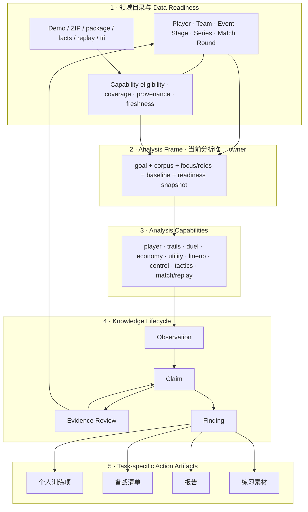
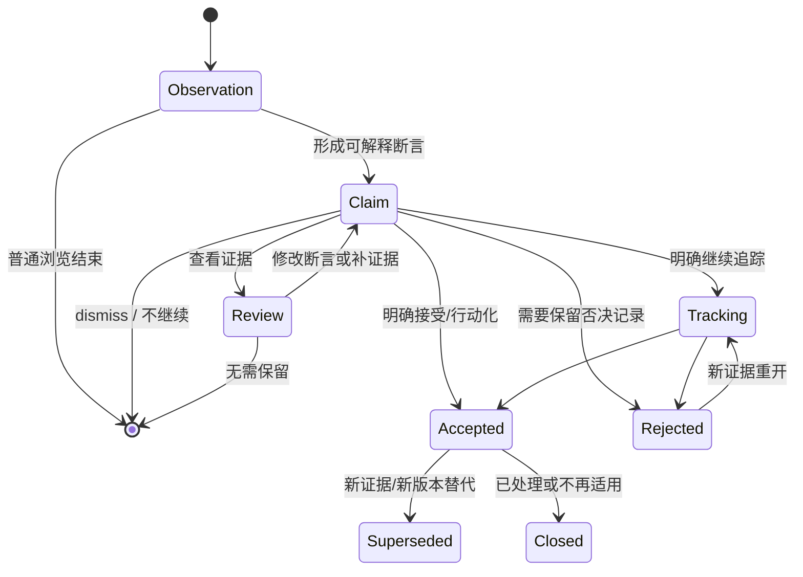

# DAK Studio Target Product Architecture

- 定义日期：2026-07-11
- 决策前提：[05-product-model-synthesis.md](./05-product-model-synthesis.md) 已选择 **Analysis Frame Workbench**；本稿不重新比较产品模型。
- 用途：把 05 的模型选择展开为可供后续产品设计、信息架构和实施共同遵守的目标产品合同。
- 边界：本稿不设计具体 UI、侧栏文案或组件，不安排 migration roadmap。

文中使用以下约束词：

- **必须**：Target Product Architecture 的不变量；违反即不属于所选模型。
- **应**：默认产品行为；只有明确记录例外语义时可以偏离。
- **可以**：允许的实现或产品选择，不由本架构强制。

## 0. Target Architecture 一句话定义

> DAK Studio 由五层组成：**领域目录与数据 readiness** 提供稳定对象和可分析数据；**Analysis Frame** 唯一拥有一次进行中的分析语义；**分析能力**在 Frame 上执行；**Observation / Claim / Evidence / Finding** 把结果变成可复核知识；**任务专属行动产物**把已接受或持续追踪的 Finding 投影为训练、备战、报告与练习材料。

唯一 ownership 规则：

> **目录拥有对象与资格，Frame 拥有当前分析，Capability 拥有计算与局部工具状态，Finding 拥有被明确提升的判断，Action Artifact 拥有任务执行形态。任何一层不得复制另一层的 owner state。**

## 1. 五层产品架构

### 1.1 Ownership 总表

| 层 | 拥有什么 | 不拥有什么 | 向下一层交付什么 |
|---|---|---|---|
| 领域目录与 readiness | 稳定对象身份、对象关系、数据来源、可用性、coverage、版本与修复原因 | 当前分析目标、谁是主体/对手、页面选择、分析结论、Finding | 稳定对象引用、resolved corpus、per-capability readiness snapshot |
| Analysis Frame | 当前分析的 goal、corpus、focus/roles、baseline、跨能力语义约束 | 表格排序、tab、回放播放位置等局部状态；分析结果；行动清单 | 一个有版本、可解释的分析输入合同 |
| Capability | 算法/分析方法、能力资格要求、局部参数、计算结果、证据候选 | 全局 scope、持久 subject、Finding 状态、其它能力的参数 | Observation、candidate Claim、Evidence candidate、一次性 action candidate |
| Knowledge lifecycle | Claim 的语义、证据关系、复核状态、Finding 版本与判断状态 | 原始资产操作、当前页面状态、任务专属执行字段 | 可追踪、可引用的 Finding |
| Action artifact | 训练、备战、报告或练习所需的任务字段与执行状态 | 重新定义 Claim、复制 Frame、篡改 provenance、成为万能收藏 | 可执行、可导出或可复用的任务产物 |

### 1.2 层间连接规则

1. 领域对象只能通过稳定引用进入 Frame；对象页面本身不成为 session owner。
2. Frame 必须引用一个已解析的 corpus 和 readiness snapshot；不能只保存模糊筛选条件。
3. Capability 必须声明消费 Frame 的哪些坐标、需要什么 readiness、增加什么局部参数、产生什么结果类型。
4. Observation 和 Claim 必须引用产生它们的 Frame revision、Capability version 与局部参数快照。
5. Evidence 必须指向领域目录中的可解析目标，并说明它与 Claim 的关系，而不只是 round/tick 地址。
6. Finding 只能由明确的继续处理意图产生；浏览、排序、点击或打开回放不能自动创建 Finding。
7. Action artifact 必须引用来源 Finding；一次性执行可以不持久化，但一旦保存、复用或进入报告，就必须保留 Finding/provenance。

## 2. 领域目录与 Data Readiness Contract

### 2.1 领域目录拥有的对象

目标领域目录必须能稳定引用：

- Player identity，包括多账号归并与“这是我”等用户关系；
- Team identity，包括别名/归并与“我的队伍”等用户关系；
- Event → Stage → Series → Match/Map 的组织关系；
- Match → Round → Tick/segment 的证据定位关系；
- Map 及其经过审核的空间语义资产。

这些对象的职责是回答“它是谁、与谁相关、由哪些比赛组成”，而不是回答“用户现在为什么分析它”。例如 FURIA 是 Team；它在某次分析中是中立 focus、comparison、beneficiary 还是 opponent，由 Frame 决定。

### 2.2 数据供应拥有的内容

数据供应层可以包含：

- 本地 `.dem` 路径；
- v3 ZIP / demo blob；
- event package 与 R2 下载来源；
- facts 投影、analysis manifest 与派生版本；
- replay、shots、grenades、tactical facts、`.tri` 等能力所需资产；
- 导入、配对、重导、重建、校验与修复操作。

这些内容可以影响 readiness，但不能成为用户分析语义。例如“分析 Cologne Major”引用 Event 及其 resolved matches；它不以 package slug 或下载任务作为 Frame subject。

### 2.3 Readiness 是 per-capability 合同

“已导入”不等于“可执行所有分析”。Readiness 必须针对能力回答：

| 字段 | 含义 |
|---|---|
| capability | 被判断的分析能力及版本 |
| status | `ready`、`partial`、`blocked`；`stale` 作为原因/风险标记，不与 coverage 混为一谈 |
| eligible corpus | 当前 corpus 中真正进入该能力计算的 match/round 集合 |
| excluded corpus | 未进入计算的对象及原因，如 facts 旧口径、缺 replay、缺 shots、缺 `.tri` |
| coverage | eligible / resolved corpus 的数量和比例；需要时包含地图、队伍、回合层 coverage |
| provenance | 数据来源、format/analysis/capability version 与关键降级路径 |
| repairability | 是否可从现有 ZIP 重建、是否需要原始 `.dem`、是否只是可选增强缺失 |

规则：

- `partial` 可以产生 Observation，但所有 denominator、Claim 与报告必须使用实际 eligible corpus，而不是原始 resolved corpus。
- `blocked` 不得用空值或 0 伪装成分析结果；它只交付缺失资格与可修复原因。
- readiness 改变后，新的浏览计算可以使用新 snapshot；已经产生的 Claim/Finding 继续引用原 snapshot，不被静默改写。
- 身份归并、Event 配对或 facts 重建若改变 resolved corpus，必须形成新的 Frame revision 或 readiness revision。

### 2.4 目录与运营边界

- Library 的浏览筛选只是在找数据，不自动改变当前 Analysis Frame。
- Management 的 import/package/storage/identity 操作只改变目录或 readiness，不自动开始分析。
- 从目录对象发起分析时，才由该对象创建或 rebind Frame。
- package/import 术语可以出现在资产运营区域；面向分析的区域只消费 Event/Match、coverage、provenance 与 repair state。

### 2.5 自底向上的数据与分析地基核验

Analysis Frame Workbench 是产品组织模型，不是底层数据模型的翻版；但它必须接受真实管线的能力上限。自底向上的核验结论是：**现有管线足以支撑显式 Frame、跨能力 Observation、部分可复核 Claim 和若干行动捷径，但并不支撑“所有分析结果都能自动成为 Claim/Finding”，更不支撑因果判断或自动训练/备战建议。**

本节核验锚点是当前锁定的 `cs2-demo-format@3.1.0` 合同，以及 `packages/core/src/index.ts`、`packages/core/src/spatial/`、`packages/cohort/src/index.ts`、`packages/presentation/src/index.ts`、`packages/presentation/src/insights.ts` 和 `apps/dak-studio/src/lib/facts.ts` 的公开输出与真实消费路径；没有把未被 Studio 消费的导出函数直接视为成熟产品能力。

为避免把“已有函数”误当作“已成立的产品能力”，本架构使用五级成熟度：

| 等级 | 含义 | 允许的产品承诺 |
|---|---|---|
| **F · Canonical fact** | v3 合同中的验证后原始事实，或目录中的稳定身份/关系 | 可作为计算输入和 Evidence address；仍需说明来源与缺失 |
| **D · Stable derivation** | 有明确口径、版本且被当前产品稳定消费的确定性派生 | 可直接成为 Observation；满足 denominator/evidence 合同时才可进入 Claim |
| **C · Claim-ready substrate** | 已有 assertion 所需指标、限定条件和可复核 evidence/representative reason | 可生成 candidate Claim，但不能自动成为 Finding |
| **O · Observation-only** | 能稳定展示趋势、排名、场或聚合值，但没有完整 Claim/evidence contract | 只能作为 Observation 或人工分析输入 |
| **X · Shadow/research** | 数据可选、模型冻结/试验中、覆盖不足或明确不进入正式评分 | 只能用于标记为实验性的观察，不得成为默认 Claim 或报告结论 |

#### 2.5.1 `cs2-demo-format` 实际提供的领域事实

v3 ZIP 的事实地基比当前页面划分更宽，但比完整产品领域模型更窄：

| 事实族 | 底层实际拥有 | 可稳定支撑 | 不拥有或不能直接证明 |
|---|---|---|---|
| Match / Player / Round | 地图、tickrate、时长、match-local Team A/B、比分、选手 Steam ID/名称、回合边界、攻守方、胜方与结束原因 | 单场、回合、选手、比分、攻守与证据定位 | 跨场稳定 Team identity、Event/Series 层级、用户与队伍关系 |
| Player stats / Economy | K/D/A、ADR、KAST、首杀/首死、trade、爆头、道具伤害、闪光、残局、多杀、特殊击杀；逐回合金钱、花费、装备、护甲、武器与道具 | 个人画像、排行、经济与转化观察 | “应该练什么”、角色职责、战术意图、表现成因 |
| Combat / Objective events | kill、damage/hitgroup、blind、bomb lifecycle、clutch、grenade 及 actor、tick、位置 | 对枪、首杀、伤害、闪光、残局、下包/拆包、道具证据 | 事件之间的因果关系；某道具或某路线“导致”胜负 |
| Optional high-frequency data | `shots`、8Hz `replay`、research-profile `duels` full-tick windows | 射击机制、轨迹、回放、RadarField、反应/预瞄的增强分析 | 对所有导入都保证可用；缺数据时的零值不代表真实为零 |
| Manifest / provenance | exporter/parser/version、source hash/name、可用文件、地图与 tickrate | 格式资格、来源追溯、能力 readiness | 分析版本、身份归并、Event 配对和用户语义；这些需 Studio/分析层补充 |

因此，Player、Match、Round 的底层引用较强；Team 的跨场身份、Event/Stage/Series 组织、self/my-team/opponent 关系必须由领域目录补足。Goal、beneficiary、baseline、Claim、Finding 与 action artifact 全都不是 demo 数据，必须明确属于产品层。

#### 2.5.2 `core → cohort → presentation → Studio` 的稳定能力边界

| 管线层 | 已稳定派生/编排的内容 | 当前最合理的结果类别 | 关键限制 |
|---|---|---|---|
| `@cs2dak/core` | AnalysisBundle、scoreboard、武器亮点、RR signals/indicators、逐回合事实、timeline、economy、heatmap、QA、duel/opening duel、mechanics、RadarField、tactical round facts | F、D、O；duel/tactical 的部分结果可成为 C | 多数输出是事实或确定性派生，不自带用户目标、Claim 文案和复核关系 |
| `@cs2dak/cohort` | 任意比赛集合上的身份归并、跨场 RR/PRISM、player rows、相对指标、tactical/opening clusters | D、O；带 coverage 与代表回合的 tactical cluster 可成为 C | “Season” 是历史命名；主要是 player cohort，没有通用 Team/Event 分析对象，也没有知识生命周期 |
| `@cs2dak/presentation` | match workspace、opening trails、leaderboard、player profile、team comparison、series、duel、season/player insights、utility value、tournament insights、report、RadarField 渲染模型 | O 为主；Mistake Review、duel、utility evidence、tactical evidence 可达到 C；report 为 action material | View Model 常有标签/故事，但没有统一 Observation/Claim/Evidence/Finding 合同；并非所有聚合都带可下钻证据 |
| `apps/dak-studio` facts / domain | 跨场 facts 投影、Event/Series/package 关系、身份别名、本地 readiness、Coach playlist/report、lineup practice gateway | 产品目录、缓存、部分 action material | 当前持久化的是能力 facts，而不是通用 Claim/Finding；各页面仍自行解释 scope、subject 与结果语义 |

两个必须显式降级的例外：

- `OfficialMapControl` 当前明确处于 review/shadow，不进入 RR MapControl 评分，且仍缺 denial/advance/UtilitySpatial 等完善；它不能被当作已验证的控图 Claim 引擎。
- `OfficialUtilitySpatial` 明确冻结在 shadow，部分 LOS 指标无 `.tri` 时为 `null`，且若干模型假设已知脆弱；它不能支撑“道具实际造成了战术效果”或因果结论。

RadarField 与这两项 shadow 指标不同：它的原始场、聚合与差分可作为稳定 Observation，但当前仍缺正式的弱区检测规则、代表回合抽取和 Claim evidence contract。因此目标控图能力可以要求未来产出 spatial Claim，当前 gap 判断则必须标为 **O，而不是 C**。

这里还有一个不能被当前页面结构掩盖的结构：`cs2-demo-format → core → cohort → presentation` 是**能力供应管线，不是每项能力都必须完整经过的产品层级**。单场工作台主要走 `core → presentation`；RadarField 走 `core → presentation rendering → Studio`；lineup 由 Studio facts 与 maps 直接组合；tactical pattern 走 `core facts → cohort clustering → Studio action`；Event/Series 组织则主要存在于 Studio 领域层。目标架构因此不能把包边界翻译成页面边界，也不能要求所有能力为了“统一”而经过同一个聚合或 View Model 层。

#### 2.5.3 当前页面是如何由管线能力直接长出来的

现有页面并非同一层级的产品模块。部分页面是完整任务工作台，部分只是某个 presentation model 或 core 输出的历史直接产品化：

| 当前区域/能力 | 当前主要真相源 | 已显示/已利用 | 尚未充分利用或不能越界的部分 |
|---|---|---|---|
| 比赛工作台 | presentation match workspace | 单场 overview、回合、比分、经济、武器、duel、地图点、replay、QA、报告 | 底层 bomb/clutch/damage/equipment/timeline 很多只在单场局部出现，尚未统一变成跨场 Claim；工作台也未保留来源 Claim continuation |
| 我的主页 / 选手档案 | cohort rows + player season/profile/insights | RR/PRISM、趋势、机制、武器、闪光、Mistake Review 与部分证据 | percentile 强弱项是 cohort-relative；除 Mistake Review 等少数模型外，很多画像没有逐项 evidence relation，不能直接等同长期诊断 |
| 对枪复盘 / 对枪概览 | core duel/mechanics + presentation duel | duel 分类、首杀、TTK、急停/首发、round/tick evidence | 反应/预瞄依赖 research duels、shots 和/或 `.tri`；optional coverage 未统一进入全局 readiness 时不能横向硬比 |
| 赛事、队伍、转化与节奏 | tournament/team comparison/season metrics | 地图、攻守、手枪、经济矩阵、人数优势、小枪翻盘、武器与队伍对照 | 多数是聚合 Observation；许多 tournament/economy 行缺通用 round evidence envelope。当前 team comparison 主要使用基础统计、武器和经济，尚不是跨 tactical/duel/utility/control 的“队伍理解” |
| 道具价值 | utility value presentation model | HE/火/闪/烟贡献、选手/队伍行、部分最佳闪光/伤害证据 | 能说明记录到的贡献与事件，不能证明某道具导致回合胜负，也不能自动生成 lineup/训练建议 |
| 开局动线 | opening trails presentation model | player/round 轨迹、道具与回合证据 | 是描述性 observation/evidence surface；路线意图、战术名称和“错误走位”没有通用数据支撑 |
| 道具点位库 | Studio facts + `@cs2dak/maps` 局部聚类 | 出手/落点、回合、practice pose、练习命令和进游戏捷径 | 是较直接的下层能力产品化；可以保存练习素材，但现有数据不能自动断言“最佳点位”或战术有效性 |
| 控图 | core RadarField + presentation normalization/render model | CT/T visibility、aim、presence、sound、时间窗、赛事地图基线与队伍差分 | 当前主要交付工程型场可视化；没有稳定 finding detector、代表证据和显著性合同。shadow MapControl/UtilitySpatial 不能拿来补齐这个缺口 |
| 教练工作台 | tactical facts + cohort clustering + Studio playlist/report | 开局压力、目标点、进点、C4 route、道具、execute timing、first kill、代表回合、清单与报告 | 已支持 opening/execute pattern 的候选 Claim 和行动闭环；不支持完整 mid-round 战术理解、意图识别、对策自动推荐或因果解释 |
| 资料库 / 赛事合集 / 管理 | Studio domain/event package/manifest | 导入、配对、组织、重建、身份与供应状态 | Event hierarchy 是 Studio 领域补充，不来自 v3；package/import 不能被伪装成用户分析对象 |

这说明所谓“跨能力统一”不是把这些页面的输出拼成一个大 dashboard。目标架构要做的是：让成熟输出进入同一 Frame 和知识合同；对于 observation-only 或 shadow 输出，保留其有效浏览价值，同时禁止越级承诺。

#### 2.5.4 数据利用结论与产品承诺闸门

当前数据利用不是简单的“少展示几个字段”：单场和专项页面已消费了相当广的底层事实，真正不足的是**跨场解释、证据关系、成熟度披露与行动交接**。

底层已有、但产品利用仍偏局部的高价值资产包括：

- bomb lifecycle、clutch、damage/hitgroup、逐回合装备与 timeline：已进入部分单场/统计能力，但尚未系统生成个人、队伍或对手的跨场 Observation/Claim；
- shots/replay 的位置、视角、移动和投射物路径：已支撑回放、动线、duel 与 RadarField，但 optional coverage 未成为所有相关结果的一等 denominator；
- player stats 中的 trade、flash、特殊击杀、残局与 bomb action：部分进入画像/报告，但不同能力的 evidence 粒度不一致；
- tactical facts 中的 opening pressure、site entry、C4 route、grenade、execute timing 与 first kill：Coach 已利用核心字段，但其可靠范围仍主要是开局/进攻模式，而非完整战术知识；
- RadarField 的多源场与时间维度：显示较充分，诊断提炼、区域语义和回放证据利用不足。

Target Product Architecture **可以立即定义**：

1. Frame、readiness、Observation envelope、Evidence address/relation、Finding 与 typed action projection 的产品合同；
2. 让现有 C 级结果进入 candidate Claim，让 O 级结果继续作为可组合 Observation；
3. 用 eligible corpus、coverage、version 和 optional dependency 约束每项结果；
4. 把 Event/Team identity、goal/role/baseline、用户判断与行动状态明确放在 Studio 产品层。

Target Product Architecture **不得假设已经存在**：

1. 任意指标都能自动生成可靠 Claim，或任意聚合都能定位 supporting/contradicting rounds；
2. 统计相关、同回合共现或聚类代表性能够证明战术因果；
3. 系统能从 demo 推断选手/队伍意图、完整角色职责、mid-round plan 或最佳对策；
4. RadarField、MapControl、UtilitySpatial 已能稳定检测弱区并解释成因；
5. 所有比赛都有 shots/replay/research duels/`.tri`，或缺失时可用 0 代替；
6. v3 自带跨场 Team/Event identity；这部分必须经过目录归并并披露置信/来源；
7. 已有通用个人训练项、跨能力备战 brief 或 Finding-driven report persistence；当前只有 Coach、lineup 与 match report 等局部 action seam；
8. team/tournament comparison 已有通用统计显著性、置信区间或因果基线；当前主要是描述性与规则型口径。

因此，后续设计若需要新的自动 Claim、弱区 Finding、战术建议或训练处方，必须被列为**新的分析/产品能力**，并补齐规则、验证、evidence extraction 与 coverage 合同；不能只通过改文案或把现有图表接到 Finding 按钮上来宣称成立。

## 3. Analysis Frame Contract

### 3.1 Frame 的产品定义

Analysis Frame 是一次进行中的分析的最小语义容器。它不是页面路由、筛选器集合、保存项目或全局 settings；它回答：

> 我正在用哪些有效数据，以谁/什么为 focus，站在什么关系与目标下，按什么基线解释结果？

Frame 默认是 ephemeral。它可以跨 Capability 持续，但不会因为持续就自动成为已保存任务。

### 3.2 最小组成

以下是产品合同，不预设最终数据 schema：

| 坐标 | 必选性 | 合同 |
|---|---|---|
| `frame identity` | 系统必选 | 唯一 id、revision、origin；语义改变必须形成可辨认的新 revision/branch |
| `goal` | 必选 | 当前分析目的；至少区分自由探索、个人复盘、选手理解、队伍理解、中立赛事分析、单场复盘、己方复盘、对手备战 |
| `corpus spec` | 必选 | Event/Series/Match/tag/manual inclusion/exclusion 等选择规则；必须能解析为确定对象集合 |
| `resolved corpus snapshot` | 系统必选 | 本 revision 实际包含的 match/round 集合、数量和目录版本；不能只保存查询条件 |
| `focus bindings` | 必选 | 至少一个 `corpus aggregate`、Player、Team、Event、Match 或关系 focus，并带明确 role |
| `baseline` | 必选 | peer/historical/opponent/corpus/alternate scope，或显式 `descriptive / none`；不能依赖能力页猜测 |
| `readiness snapshot` | 系统必选 | 各能力 eligibility、coverage、版本与降级；按能力消费 |
| `actor / beneficiary` | 条件必选 | 个人复盘、己方复盘、对手备战等带视角的 goal 必须有；中立探索可以省略 |
| `relationship bindings` | 条件必选 | opponent、comparison、beneficiary 等关系型 goal 必须有；单对象中立分析可以省略 |
| `semantic facets` | 可选 | 需要跨多个 Capability 持续的 map、side、period、economy 等约束；仅在其改变整个分析问题时进入 Frame |
| `parent / derivation` | 条件必选 | refine 或 rebind 产生的新 Frame 必须说明来源与改变了什么 |
| `persistence` | 系统必选 | `ephemeral` 或 `saved brief`；保存 Frame 不等于保存其中所有 Observation |

### 3.3 Corpus、Focus 与 Baseline 必须分开

这是 Target Architecture 最重要的语义约束：

- **Corpus** 决定哪些数据有资格进入计算；
- **Focus** 决定结论描述谁/什么；
- **Baseline** 决定 focus 与什么参照解释；
- **Role/Goal** 决定相同对象为何被分析。

例如：

| 场景 | Corpus | Focus | Baseline | Goal/Role |
|---|---|---|---|---|
| 看 FURIA 在示例赛事中的表现 | 示例赛事 7 场 | FURIA | 同一赛事全部队伍/场次 | 中立队伍理解 |
| 只研究 FURIA 最近比赛 | FURIA 出场的最近 N 场 | FURIA | FURIA 历史或 peer | 队伍理解 |
| Vitality 备战 FURIA | FURIA 的可用对局，可跨对手 | FURIA as opponent；Vitality as beneficiary | FURIA 历史/赛事 peer | 对手备战 |
| 赛事地图基线 | Event 内某图全部 eligible rounds | corpus aggregate | descriptive / none | 中立赛事分析 |

选择 Team 不得隐式决定是否收窄 corpus；选择 Event 也不得同时暗示它是 focus。两者必须由 Frame 明确表达。

### 3.4 Frame 与局部参数的边界

一个参数只有同时满足以下任一条件，才进入 Frame：

1. 它应跨两个或以上 Capability 持续；
2. 它改变 Claim 的 subject、denominator、baseline 或 goal；
3. 用户明确把本次分析细化为该约束。

否则它属于 Capability local state。典型局部状态包括：

- table sort、分页、展开/折叠、当前 tab；
- replay tick、播放速度、图层开关；
- 当前 hover、临时证据筛选、radar Top N；
- lineup cluster mode、一次性 weapon/grenade filter；
- 仅用于当前图表呈现的颜色、模式与对照开关。

Map、side、time range、economy state 既可能是 Frame facet，也可能是局部参数。判断标准不是控件位置，而是它是否改变跨能力分析问题。Capability 不得自行把局部参数写回 Frame。

### 3.5 Frame 生命周期操作

#### Create

- Frame 可以由对象入口、目标入口、Capability 直达或已有 Finding/brief 创建。
- 允许系统用入口语义和稳定用户默认值生成 Frame；不允许生成用户不可感知的隐式状态。
- `self player`、`my team` 等持久设置只是默认 binding 来源，不是正在运行的 Frame。
- 若必选坐标尚不完整，Frame 处于 draft，Capability 只能返回缺失合同，不能猜测并静默运行。

#### Inherit

- 用户在同一分析中切换 Capability 时，必须继承同一 Frame id/revision。
- Capability 可以只消费其中一部分坐标，但必须声明未消费的坐标；不能把未消费解释为已重置。
- Inherit 不复制 Frame，也不创建新的 saved state。

#### Refine

- Refine 在保持 goal 与主要 role 不变时，缩小 corpus、添加跨能力 facet 或增加更具体 focus。
- Refine 必须产生可逆的 child revision/branch，并保留 parent。
- “只看 de_inferno”“只看 CT 长枪局”如果要带到多个 Capability，属于 refine；仅在一张图中临时切换则仍是 local state。

#### Rebind

- Rebind 改变主要 focus、beneficiary/opponent/comparison role、goal 或 baseline。
- Rebind 必须形成新的 Frame branch；旧 Claim/Finding 继续属于旧 Frame。
- 从“中立理解 FURIA”进入“Vitality 备战 FURIA”是 rebind，不是继承一个 team chip。

#### Reset

- Reset 必须有明确目标：撤销某一 refinement、回到 parent，或回到入口 preset。
- Reset 不能清空目录身份默认值，也不能删除已保存 Finding/Action artifact。
- “全部”必须明确是 corpus reset、focus reset 还是 local filter reset，不能用同一语义覆盖三者。

#### End / Save / Resume

- 一个工作上下文中只能有一个 active root Frame；证据 review 和临时 drill-down 作为 continuation 存在，不建立平行 global state。
- 开始无关分析、明确结束或关闭工作上下文时，ephemeral Frame 可以被丢弃；其未提升 Observation/Claim 同时消失。
- 保存 Frame 会形成 `saved brief`，但不会自动保存所有 Observation/Claim。
- Resume 使用保存时的 Frame snapshot，并对当前 readiness 做差异检查；不得静默用新数据改写旧 Claim。

### 3.6 Evidence Review 不是默认 Frame 切换

从 Claim 打开 match/round/tick 时，默认建立 transient `Review Context`，而不是把 cohort Frame 替换成单场 Frame：

| Review Context 内容 | 作用 |
|---|---|
| parent Frame revision | 保留原分析语义与 denominator |
| claim reference | 说明正在验证什么 |
| evidence target | match/round/tick/region/aggregate slice |
| evidence relation | supports、contradicts、context、example、representative 及理由 |
| return continuation | 回到原 Claim、原能力与局部位置 |
| review outcome | supports、contradicts、inconclusive、not reviewed |

用户如果从证据转而“独立分析这场比赛”，才显式 derive 一个 single-match Frame。普通证据查看不得悄悄改变 parent corpus、goal 或 focus。

### 3.7 Frame 可感知性合同

为了避免 Frame 退化为隐形全局状态，任何 active Frame 都必须能被产品压缩成一条稳定、可检查的语义摘要：

> goal · focus/roles · corpus 与样本数 · baseline/denominator · readiness/coverage

并满足：

- 用户能区分当前值来自入口默认、继承、refine 还是 rebind；
- 任何语义变化产生新 revision，并能说明改变了哪些坐标；
- 每个 Capability 结果都可追溯到 Frame revision 与实际 eligible coverage；
- 与 Capability 不兼容的 Frame 必须要求 refine/rebind 或返回 blocked，不得静默丢掉 subject/goal；
- 页面局部状态不得混入 Frame summary；
- 退出普通浏览后，不得在无提示情况下把旧 opponent/goal 带入无关分析。

## 4. Claim–Evidence–Finding Lifecycle Contract

### 4.1 生命周期总览

图中的 `Tracking / Accepted / Rejected / Superseded / Closed` 都是 Finding 状态。Dismissed Claim 默认不持久化。

### 4.2 Observation

Observation 是能力对 Frame 运行后的原始可解释结果，例如：

- RR/ADR/转化率、排名和趋势点；
- 某类对枪、某个回合或某组道具事件；
- 开局轨迹、lineup cluster、tactical pattern；
- 覆盖场、热点或 baseline delta；
- readiness、coverage 与缺失数据事实。

Observation 必须可重现地引用：Frame revision、Capability/version、local parameter snapshot、eligible corpus 与 metric/pattern definition。

Observation 默认 ephemeral。排序靠前、颜色异常、被点击或被回放，都不自动让它成为 Claim/Finding。

### 4.3 Observation 何时成为 Claim

Observation 只有在形成以下完整表达时才成为 Claim：

| Claim 最小部分 | 要回答的问题 |
|---|---|
| assertion | 系统或用户到底在声明什么 |
| subject/relationship | 这句话描述谁、哪种关系 |
| frame reference | 在什么 corpus、goal、baseline 下成立 |
| measure/pattern basis | 使用了什么指标、模式、阈值或比较 |
| denominator/coverage | 样本与缺失是什么 |
| evidence candidates | 哪些 aggregate/round/tick 可能支持或反驳 |
| evidence reason | 为什么这些证据与 assertion 有关 |
| qualifier | 不确定性、代表性限制、降级或反例 |
| producer/version | 哪个 Capability/规则或用户形成了它 |

“FURIA 5v4 转化率 72%”是 Observation；“FURIA 在当前赛事的 18 个 5v4 回合中转化 13 个，高于同一赛事基线 61%；在披露样本量与未做显著性推断的前提下，值得继续复核其优势局处理”才是 Claim。后者必须同时说明 denominator、baseline、qualifier 与 evidence basis；没有统计检验时不能使用“显著强于”。

系统可以自动生成 candidate Claim，用户也可以从 Observation 写出 Claim；两者都不自动持久化。

### 4.4 Evidence 与 Evidence Review

Evidence 不是一个脱离 Claim 的万能收藏对象。它是“某个目标以某种关系支持/反驳某个 Claim”：

| Evidence relation | 含义 |
|---|---|
| supports | 直接支持 assertion |
| contradicts | 构成反例或削弱 assertion |
| context | 提供必要背景，但不单独证明 |
| example | 是可读示例，不声明统计代表性 |
| representative | 被选择为代表性样本；必须说明代表性的计算或选择理由 |

Evidence target 可以是 aggregate slice、match、round、tick、player event、grenade occurrence、spatial region/interval。所有 target 必须可解析到目录和 readiness，并带目标缺失/不可播放状态。

Review 必须允许记录 `supports / contradicts / inconclusive / not reviewed`，而不是把“打开过回放”当作验证成功。

### 4.5 Claim 何时升级为 Finding

满足以下任一明确意图时，Claim 可以升级：

- 用户接受它作为当前可用判断；
- 用户希望继续追踪它，而不是当场判断；
- 用户将它用于训练、备战清单、报告或持久练习素材；
- 用户需要保留否决结果，以阻止同一自动 Claim 反复出现或支持审计。

升级前必须满足：

1. assertion 可被理解和修改；
2. Frame revision、denominator、coverage 与 producer 可追溯；
3. 至少有一个 evidence basis。它可以是 aggregate basis，不强制每个 Claim 都有单回合；
4. Claim 的限制与未复核部分没有被隐藏；
5. 用户有明确继续处理意图。系统不能仅因“高分”“异常”或“已点击”自动升级。

现有“加入备战清单”之类的明确行动可以**原子地完成 Claim 提升 + Finding 创建 + Action Projection**，不要求用户先经过额外的项目管理步骤。

### 4.6 Finding 状态与修改规则

| 状态/动作 | 合同 |
|---|---|
| tracking | 尚未下最终判断，但值得持续收集新样本或复核；必须说明关注条件 |
| accepted | 当前证据下可用于判断或行动；不表示永恒正确 |
| rejected | Claim 被明确否决；只有需要去重、审计或后续重开时才持久化 |
| modify | 修改形成新 revision；若 assertion、subject、corpus 或 baseline 实质改变，应创建新 Finding 并以 `supersedes/derived-from` 关联 |
| continue tracking | 追加新的 readiness/frame snapshot 与 evidence relation，不覆盖旧 provenance |
| superseded | 新 Finding 或新口径取代旧判断；旧记录仍可追溯 |
| closed | 已完成行动、已失效或无需继续；Action artifact 不因此被删除 |

Finding 必须拥有：稳定 id、type、current status、Claim revisions、Frame snapshot/reference、Evidence relations、provenance、创建/修改来源、可选 Action references。它不拥有 Capability local state 或原始资产。

### 4.7 什么不应该被持久化

默认不得持久化为 Claim/Finding：

- 每个 table row、图表点、排序结果或 hover；
- 一次性 map/weapon/grenade/filter/tab 选择；
- 访问过的每个 match/round/tick；
- 未形成 assertion 的指标异常；
- 自动生成但用户未继续处理的 candidate Claim；
- 只为返回位置存在的 Review Context；
- ephemeral Frame 中未提升的 Observation；
- 一次性复制的 practice command 或一次性“进游戏”动作；
- 因数据缺失而产生的空值；readiness issue 应进入 readiness，而不是 Finding；
- 普通 dismiss。只有为防重复或审计明确保存时，否决才成为 rejected Finding。

### 4.8 Action Projection Contract

| 产物 | 可接受的来源 | 专属字段 | 与 Finding 的关系 |
|---|---|---|---|
| 个人训练项 | accepted/tracking 的个人行为或机制 Finding | 训练目标、练习方式、复查条件、适用 player | 引用 Finding；训练进度不反写 Claim |
| 备战清单 | accepted/tracking 的 opponent/tactical Finding | beneficiary、opponent、map/side、代表证据、备注、优先级 | 一个 Finding 可投影多个 evidence items；清单项不复制完整 Claim |
| 报告 | 一组 accepted/tracking Findings + saved Frame snapshot | 受众、章节、结论顺序、coverage/limitations | 是组合视图；Finding 更新后可显式刷新，不静默改写历史导出 |
| 练习素材 | accepted Finding 或用户明确接受的 evidence-backed recipe | map、pose、command、utility/tactic、复现条件 | 一次性执行可不保存；持久复用必须引用 Finding/evidence provenance |

不同产物可以共享 Finding provenance，但不能合并成一个全局“收藏夹”数据模型。

## 5. Capability Contract

### 5.1 所有 Capability 的统一合同

每个 Capability 必须声明：

1. **Required Frame inputs**：需要哪些 goal/focus/role/corpus/baseline/facet；
2. **Readiness requirements**：需要哪些 facts/replay/shots/grenades/tri/source demo，允许什么 partial/degraded 模式；
3. **Local parameters**：只影响该能力、不会写回 Frame 的参数；
4. **Output classes**：Observation、candidate Claim、Evidence candidate、one-off action candidate 中哪些可能产生；
5. **Evidence policy**：哪些输出能关联 aggregate 或具体 round/tick，以及 representative reason；
6. **Context behavior**：继承、请求 refine/rebind 或 blocked；Capability 永远不是 Frame owner；
7. **Version/provenance**：结果必须标记 capability/metric/model version 与实际 eligible coverage。

能力可以缓存计算和局部 view state，但不得持久化自己的 corpus、subject、goal 或 Finding 列表。需要改变这些坐标时，只能请求 Frame refine/rebind。

### 5.2 当前主要 Capability 目标合同

| Capability（当前主要承载面） | 消费的 Frame | 可增加的局部参数 | 主要输出 | 上下文所有权与边界 |
|---|---|---|---|---|
| 个人/选手长期画像（我的主页、选手档案） | corpus、Player/self focus、personal/player goal、baseline、player facts readiness | 指标分组、展示周期、武器/机制视图；若 comparison player 改变结论语义则必须 rebind/refine | Observation；Mistake Review 等带证据结果可产 candidate Claim；其余画像需先补 evidence policy | **不拥有** player/session；主页负责编排与提出 candidate Claim，档案负责纵向分析 |
| 单场/系列赛分析与 Replay（比赛工作台） | single-match Frame，或 parent Frame + Review Context；可选 Claim ref | round、tick、播放状态、图层、单场 tab、系列汇总模式、QA 展开 | Observation、Evidence、review outcome | **不替换 parent Frame**；只拥有播放与单场局部状态。独立探索该场时才 derive single-match Frame |
| 开局动线 | corpus、Player/Team focus、goal、可选 map/side facet、trajectory readiness | 最近 N 场、动画时间窗、显示回合、道具层；map/side 仅在单页临时查看时为 local | Observation、round evidence；路线/失误 Claim 需要新增规则或用户解释 | **不拥有** selected player/map；跨能力 map/side 由 Frame refine |
| Duel（对枪复盘 / 对枪概览） | corpus、Player/Team/corpus focus、goal、baseline、duel/shots readiness | evidence classification、weapon、map、time segment、机制/热点视图 | Observation、candidate Claim、Evidence | **不拥有** scope/subject；review 与 overview 是 goal/presentation preset，不要求两套分析上下文 |
| 排行榜 | corpus、aggregate/event focus、peer baseline、rating readiness | 指标列、排序、分页 | Observation；只有明确 ranking basis/coverage 后可产出排名 Claim | **不拥有** player；选择 player 应 derive/rebind Player Frame，不把 player 变成局部 filter |
| 赛事/队伍总览 | corpus、Event/aggregate/Team focus、goal、baseline、coverage | 地图/武器视图；team pair 若只是临时读图可 local，若跨能力比较则 rebind relationship | 当前以 Observation 为主；补齐 evidence envelope 后才产 candidate Claim | **不拥有** Event/Team session；不处理 package 生命周期 |
| 转化与节奏 | corpus、Team/aggregate focus、baseline/denominator、economy facts readiness | economy state、side、man-advantage state、map；跨能力约束需 refine | Observation；补齐 eligible denominator 与 round evidence 后才产 candidate Claim | **不拥有** team lens；必须区分全局 aggregate 与 focus team 行 |
| 道具价值 | corpus、Player/Team/aggregate focus、baseline、grenade/flash facts readiness | grenade type、map、side、ranking metric | Observation；现有最佳闪光/伤害可产 candidate Claim 与 grenade/round evidence | **不拥有** player/team；“贡献评估”不等于 lineup practice，更不等于因果效果 |
| 道具点位/Lineup | corpus、map focus/facet、可选 Team/side role、practice/scout goal、grenade pose readiness | grenade type、side、cluster mode、Top N、当前 cluster | Observation、throw evidence、one-off practice candidate；有效性 Claim 需要新的分析合同 | **不拥有** practice task；一次性复制/进游戏可直接执行，持久练习素材必须经 Finding projection |
| 控图 / RadarField | corpus、map facet、Team/aggregate focus、baseline、spatial readiness | field source、time phase、显示模式；临时 team/baseline toggle 只用于呈现时可 local | 当前为 Observation；只有新增稳定 detector、区域语义与代表回合 extraction 后才产 candidate spatial Claim | **不拥有** map/team scope；必须明确 corpus baseline 与 team contribution，不能把场可视化直接叫 Finding |
| Tactical Pattern / Map Pool / BP | corpus、beneficiary/opponent/subject roles、own-review/opponent-prep goal、baseline、tactical facts readiness | map、side、economy bucket、cluster selection、pattern naming | Observation、candidate Claim、representative evidence、one-off action candidate | **不拥有** Coach scope；当前“加入”可原子提升 Finding 并投影 playlist |
| Report composition | saved Frame + accepted/tracking Findings + coverage | 受众、顺序、章节、包含/排除项 | Action artifact，不产生新的分析事实 | **不拥有** Finding 或 Frame；报告引用来源，不能把排版选择写回 Claim |

#### 5.2.1 当前能力的结果成熟度闸门

这张表用于约束“目标职责”与“当前可交付”的区别，不是 roadmap：

| 当前成熟度 | 能力/结果 | 进入知识生命周期的上限 |
|---|---|---|
| **C · Claim-ready substrate** | Mistake Review；带 round/tick 的 Duel；带代表回合与 coverage 的 Tactical Cluster；带具体 grenade/round 的最佳闪光/伤害 | 可生成 candidate Claim，进入 Evidence Review；仍需用户或规则明确 promotion |
| **条件型 C** | cohort-relative player strength/weakness、排名、RR/PRISM 相对表现 | 只有 baseline、样本门槛、coverage 与 qualifier 显式时可成为 aggregate Claim；无单回合证据时不得伪造 replay review |
| **O · Observation-only** | Match workspace 大部分指标、Tournament/Team/Economy 聚合、Opening Trails、RadarField 场、Lineup clusters | 可以跨能力组合和人工解读；补齐 assertion/evidence policy 前不能自动进入 Finding |
| **X · Optional/research** | full-tick duel 的 reaction/preaim，以及依赖 shots/replay/`.tri` 的增强机制 | 仅在 readiness 明确满足时交付；partial/blocked 不能与基础 duel 结果混为同一 coverage |
| **X · Shadow** | OfficialMapControl、OfficialUtilitySpatial actual-effect | 仅实验性观察；不得成为默认 Claim、报告结论或训练/备战建议依据 |
| **Existing action seam** | Coach playlist/Markdown report、lineup practice command/进游戏、match report | 可以保留快捷动作；若持久化并跨任务复用，目标态必须补 Finding/provenance 引用 |

这里最重要的产品约束是：**Capability contract 声明“最多能产出什么”，不保证每次都产出该类别。** 同一能力可在数据完整时产 candidate Claim，在 coverage 不足时只产 Observation，blocked 时只产 readiness explanation。

### 5.3 Capability 之间的组合规则

- Capability 之间不直接传私有 state；都通过同一 Frame 和显式 Claim/Finding 引用协作。
- 一个 Capability 的 local parameter 不能成为另一个 Capability 的隐式默认。
- 跨能力继续分析同一问题时继承 Frame；继续验证同一断言时同时携带 Claim ref。
- Capability 可以建议 refine/rebind，但改变只有在 Frame 层生效。
- 同一计算内核可以有不同目标叙事，例如 Duel review/overview；产品面是否合并不由架构强制。
- 若 Capability 只能提供 Observation、尚不能解释 evidence reason，它不得伪装成自动 Claim 生成器。

## 6. 现有产品区域在目标架构中的职责

以下是逻辑职责映射，不承诺保留当前页面数量、分组或容器形状。

| 当前区域 | 目标职责 | 应保留的有效能力 | 必须停止拥有/混合的职责 |
|---|---|---|---|
| 我的主页 | 个人 Frame launcher、self 状态编排、candidate Claim 入口、未完成个人 Finding/训练项摘要 | “这是我”后的近期状态、带证据的复盘优先项、证据入口 | 不把规则型指标直接写成训练处方；不作为另一套 player profile 数据层；不把所有卡片持久化；不在离开后丢失 Claim continuation |
| 资料库 | Match/Demo 领域目录、导入入口、基础 readiness/coverage、数据定位 | 导入、检索、标签、重建、单场入口、回放/原始 demo 可用性 | 浏览筛选不自动成为分析 corpus；不承担 Event package 的用户分析语义；不拥有 current Frame |
| 比赛工作台 | 单场分析 Capability + 通用 Evidence Review resolver | 单场/系列赛、回合、2D 回放、QA、round/tick 定位 | 不把证据跳转降为无来源 deep link；不替换 parent Frame；不把播放 state 写入 Frame |
| 选手档案 | Player 目录选择 + 长期画像 Capability；可创建/rebind Player Frame | 身份、画像、趋势、机制、道具、失误与证据 | 不成为永久 session owner；comparison 若改变结论必须进入 Frame relationship，而非私有 compare state |
| 开局动线 | Opening Trails Capability | Player × map × side 的轨迹与证据回合 | 不私有 selected player/map/side 的跨页语义；不承担战术 Finding/playlist |
| 对枪复盘 / 对枪概览 | 同一 Duel Capability 的个人复核与聚合态势两种 goal/presentation preset | 证据队列、机制、首杀热点、回放入口 | 不维护两套 scope；是否继续分面由后续 IA 决定，不由共享实现或架构整洁决定 |
| 赛事与队伍 | 逻辑拆为 Event/Series 领域浏览、Leaderboard/Tournament/Team Capabilities、创建 Event/Team Frame 的入口 | 赛事层级、排行榜、宏观盘面、队伍比较 | 当前容器不是架构层；不得同时拥有 event package 生命周期、分析 scope 和 team session |
| 转化与节奏 | Economy/Conversion Capability | 手枪、人数优势、小枪翻盘、经济矩阵 | 不私有 team lens；结论必须绑定 denominator、subject 与 round evidence |
| 道具价值 | Utility Contribution Capability | HE/火/闪/烟价值、选手/队伍榜、证据 | 不与 lineup practice 合并成同一能力；不因同属“道具”共享 action sink |
| 道具点位库 | Lineup Discovery Capability + one-off practice gateway + Practice Material projection source | 聚类、出手/落点、回放、进游戏、练习命令 | 不拥有备战任务；持久化素材必须引用 Finding/evidence；一次性动作无需强制任务化 |
| 控图 | Spatial Analysis Capability | 赛事地图基线、队伍贡献/差分、覆盖场 | 不私有 team/map scope；当前场模型保持 Observation。若未来产出 Claim，必须新增弱区/差分规则、区域语义、代表证据与 coverage，不能只改图表命名 |
| 教练工作台 | own-review/opponent-prep Frame launcher/rebind surface、Tactical Capability 组合、saved brief 与 action projections | pattern、代表证据、playbook 命名、playlist、map pool、report | 不维护与 Frame 平行的 corpus/subject/role；必须接收外部 Capability 的 Findings；不成为全产品唯一 action sink |
| 管理 | Identity、资产、Event package、storage、readiness repair 与操作审计 | 身份归并、赛事资产、存储维护、修复 | 不成为 Event 分析入口的语义 owner；import/repair 不自动改变 active Frame 或历史 Finding |

### 6.1 资料库、赛事合集与管理的最终逻辑边界

- **资料库**回答“本地有哪些 Match/Demo，它们能否被基础读取与重建”。
- **赛事合集/领域目录**回答“这些 Event/Stage/Series/Match 如何组织，以及从哪个对象开始形成分析 corpus”。
- **管理**回答“数据与身份如何获取、配对、修复和治理”。
- **Analysis Frame**回答“此刻正在分析哪个 resolved corpus、focus、goal 与 baseline”。

它们可以在未来 IA 中相邻或交叉跳转，但不得共享同一个含糊的“赛事状态”。

## 7. 关键用户旅程

### 7.1 个人发现 → 分析 → 证据 → 回放 → 返回

1. 用户从个人入口进入；产品用稳定 `self player` 默认值创建 ephemeral Frame：
   - goal = personal review；
   - corpus = 当前个人近期策略解析出的 matches；
   - focus = self player；
   - baseline = 个人历史/peer 或显式 descriptive；
   - readiness = player/duel/replay coverage。
2. 个人画像能力产生 Observation；“长枪局首死 3/39”只有在带 denominator、问题解释与 evidence reason 后才成为 candidate Claim。
3. 用户进入专项分析时继承同一 Frame；Duel/Trails/Player capability 不重新选择 self 或 corpus。
4. 用户打开 de_inferno R12 时建立 Review Context，保留 parent Frame、Claim 与 evidence relation；Match/Replay 定位 R12/tick。
5. 用户记录 review outcome：supports、contradicts 或 inconclusive。
6. 返回时恢复同一 Claim、同一 Frame revision 和调用位置；不是返回一个泛化首页或 R1。
7. 用户可以 dismiss（不持久化）、tracking、accepted 或 rejected；accepted/tracking Claim 升级为 Finding。
8. 若用户把它用于训练，可原子创建 Personal Training Item；训练项引用 Finding，并定义复查条件。

旅程成立的判断不是“能返回上一页”，而是用户始终知道正在验证什么、证据为何相关、回去后能继续同一判断。

### 7.2 队伍理解 → 跨能力分析

1. 用户从 Team 目录、排行榜或任一能力中的 Team 对象创建/rebind Frame：
   - goal = team understanding；
   - focus = FURIA；
   - corpus = 当前 Event/自定义比赛集；
   - baseline = 同 corpus 的所有队伍、FURIA 历史或显式替代基线。
2. Frame summary 明确区分“7/7 corpus”与“FURIA focus”，不再用 team selection 暗示是否过滤比赛。
3. Tournament、Economy、Duel、Utility、Control 继承同一 Frame；各自只增加局部参数。
4. 用户若要跨能力聚焦 de_inferno/CT，执行 refine；若只临时查看某图，则参数留在当前能力。
5. 每个能力产生符合自身成熟度的 Observation 或 candidate Claim，但都引用同一 Frame revision；用户无需重新设定 FURIA。Observation-only 能力不会因为跨页组合就自动升级。
6. 用户可以只浏览而不保存；只有跨能力仍值得继续的强项/弱项才升级为 Finding。
7. 若用户转为“我方备战 FURIA”，执行 role/goal rebind，形成新 Frame；旧中立 Team Findings 不被静默改写，可以被显式引用为来源。

### 7.3 赛事导入/readiness → 范围 → 分析

1. 用户导入 event package 或下载赛事资产；该操作更新数据供应、Event/Series/Match 目录和 readiness，不自动创建 Frame。
2. 系统解析：已组织 series、已配对 matches、缺失 maps、facts/replay/shots/tactical readiness、版本与 repairability。
3. 用户从 Event 领域对象发起分析，创建 Frame：
   - goal = neutral event analysis；
   - corpus spec = Event/Stage/Series 选择；
   - resolved corpus = 当前实际匹配到的 matches；
   - focus = Event aggregate 或指定 Team/Player；
   - baseline = event corpus / peer / descriptive；
   - readiness = per-capability coverage。
4. 排行榜、赛事总览、经济等能力各自消费 eligible corpus；partial coverage 必须明确改变 denominator。
5. 若用户进入某个 Series/Match 查看证据，默认建立 Review Context；若开始独立单场复盘，才 derive single-match Frame。
6. 后续补齐 demo 或重建 facts 会产生新 readiness revision。旧 Claim/Finding 继续保留旧 coverage；新分析可显式刷新到新 Frame revision。

这条旅程中，package 只影响供应与 readiness；用户的 Event 分析对象始终是 Event/Stage/Series/Match。

### 7.4 对手发现 → 证据 → Finding → 清单/报告

1. 用户创建或 rebind opponent-prep Frame：
   - beneficiary = Vitality；
   - opponent/focus = FURIA；
   - corpus = FURIA 的 eligible 对局，可跨对手；
   - goal = opponent preparation；
   - baseline = FURIA 历史、赛事 peer 或指定对照；
   - readiness = tactical/duel/economy/utility/control coverage。
2. Tactical Pattern、Map Pool、Economy、Duel、Utility、Control 均消费同一 Frame；Coach 不再维护平行 team/scope。
3. 能力按成熟度产生结果：Tactical 等 C 级结果可生成某图 T 方开局模式的 candidate Claim；5v4 聚合需要补齐 round evidence 后才可成为 Claim；RadarField 的覆盖薄弱区在当前只能是 Observation 或人工提出的 Claim，除非新增并验证 detector、区域语义与代表回合 extraction。
4. 用户进入 Match/Replay 复核，Review Context 保留对手 Frame 与 Claim。
5. 用户选择“加入清单”时，可以原子完成：接受/跟踪 Claim → 创建 Finding → 以代表 evidence 投影 Playlist Item。
6. 其它已接受/跟踪 Findings 也可进入同一 saved brief；不要求它们来自 Tactical Capability。
7. 报告由 saved Frame snapshot + Findings + coverage/limitations 组合；报告不复制或重新解释原 Claim。
8. 新比赛进入 corpus 后，tracking Finding 可以追加新 evidence；已导出的历史报告不会被静默改写。

## 8. 架构边界与失败模式

| 失败模式 | 强制边界 | 可观察的失败信号 |
|---|---|---|
| Frame 变成巨大隐形状态 | Frame 只含跨能力语义坐标；一 active root；局部状态单独保存；所有语义变化有 revision 和 summary | 用户无法说清当前 goal/focus/corpus；切能力后出现无来源旧选项；Frame 中出现 tab/sort/tick |
| 普通浏览被任务化 | Frame 默认 ephemeral；Observation/Claim 默认不持久化；只有明确继续处理或行动才升级 | 打开指标就生成待办；浏览赛事前必须建 case；未读 Claim 堆积 |
| Finding 变成万能收藏 | Finding 必须有 assertion、Frame、evidence basis、status；Action artifact typed projection | 收藏里混有表格行、回放、命令、报告和任务，却无法回答“判断是什么” |
| Capability 重新私有 scope/subject | Capability 声明 Frame inputs/local params；只能请求 refine/rebind，不能持久化自己的 corpus/subject | 同一 Team 在各页含义不同；切页要重选；某页 secretly 缩 denominator |
| 对象目录膨胀成大量 workspace | 对象只提供 stable reference 与入口；关系/goal 属于 Frame | 每个 Team×opponent×map 都变成新对象；能力在多个对象页重复实现 |
| package/import 污染用户领域模型 | package 留在 supply/management；分析只见 Event/Match、readiness、coverage、provenance | Frame subject 出现 package slug；“赛事”同时表示下载任务和分析对象 |
| Evidence 退化为地址 | Evidence relation 必须带 Claim 与支持/反驳/代表理由；Review Context 保存 continuation | 用户到达正确 R12 却不知道为何要看；打开过即被视为已验证 |
| Frame 数据漂移改写历史结论 | Claim/Finding pin Frame/readiness revision；刷新显式产生新 revision | 导入新 demo 后旧报告数字无痕变化；无法还原旧 denominator |
| Action artifact 与 Finding 分叉 | 产物引用 Finding/revision；任务字段与 Claim 分离；刷新必须显式 | Playlist note 成为唯一结论；报告修改后无法追溯原证据 |
| 模型纯度破坏有效捷径 | 显式 action 可原子完成 promotion + projection；一次性动作无需持久化 | 为复制练习命令或加入清单强迫用户先创建多层对象/任务 |
| Readiness 被当作空数据 | blocked/partial/stale 有独立合同；不 coerce 为 0；denominator 使用 eligible corpus | 缺 shots 显示“机制为 0”；旧 facts 与新 facts 混算；报告不披露 coverage |
| 输出类别超过分析成熟度 | 每个 Capability 声明 F/D/C/O/X 成熟度和最大 output class；升级需新增验证与 evidence contract | 热图改名即成为“弱区 Finding”；排行榜卡片自动变诊断；shadow 指标进入正式报告 |
| 可选数据被当作全量地基 | shots/replay/duels/`.tri` 分别进入 readiness 与 eligible corpus；增强指标不得污染基础口径 | 只有部分比赛有 reaction time，却拿全 corpus 做比较；缺 `.tri` 的 null 被当成 0 |
| 相关性被写成因果或处方 | 数据只支持描述/规则/关联时，Claim qualifier 必须保留；因果、最佳策略、训练处方需独立验证合同 | “这颗烟导致取胜”“该路线是错误”“应该练 X”只由共现或排名推出 |
| 原始数据多就直接堆新页面 | 新产品面必须服务 Frame 内任务或 Evidence/Action 闭环；底层字段可以留在现有能力的详情层 | 每新增一个 core/presentation model 就出现一级页面；用户仍无法从发现回到证据与行动 |

## 9. Target Architecture 不变量

下一轮“当前产品 → 目标产品”差距比较，可以直接逐项检查以下合同：

### Domain / Readiness

- **TPA-01**：Player、Team、Event、Stage、Series、Match、Round 有稳定领域引用，且与 package/import/storage object 分离。
- **TPA-02**：每个主要 Capability 有 per-capability readiness、eligible/excluded corpus、coverage、version 与 repair reason。
- **TPA-03**：导入、重建、身份归并和 Event 配对只更新目录/readiness，不静默改变 active Frame 或历史 Finding。

### Analysis Frame

- **TPA-04**：任何分析结果都可追溯到一个 Frame id/revision。
- **TPA-05**：Frame 至少明确 goal、corpus snapshot、focus/roles、baseline 和 readiness；条件型 goal 明确 beneficiary/opponent。
- **TPA-06**：Corpus、Focus、Baseline、Role 分离；Team selection 不隐式兼任 filter、subject 与 opponent。
- **TPA-07**：Capability 切换继承 Frame；refine/rebind/reset/end 都有明确语义和 revision。
- **TPA-08**：Frame 可以被压缩为 goal · focus/roles · corpus/count · baseline · readiness/coverage，并能说明来源。
- **TPA-09**：Capability local state 不进入 Frame；一个工作上下文只有一个 active root Frame。
- **TPA-10**：证据 drill-down 默认使用 Review Context，不把 parent Frame 静默替换为 single-match Frame。

### Knowledge Lifecycle

- **TPA-11**：Observation 默认 ephemeral，且引用 Frame、Capability/version、local params 与 eligible corpus。
- **TPA-12**：Claim 包含 assertion、subject、Frame、measure/pattern basis、denominator/coverage、evidence reason 与 qualifier。
- **TPA-13**：Evidence 表达 supports/contradicts/context/example/representative 关系，不只是地址。
- **TPA-14**：Finding 只能由明确继续处理意图产生，并支持 tracking/accepted/rejected/revision/superseded/closed。
- **TPA-15**：普通 dismiss、浏览、排序、回放、一次性 action 不自动持久化。
- **TPA-16**：Action artifact 引用 Finding 与 Frame snapshot；不同任务产物不合并成万能收藏。

### Capability / Product Areas

- **TPA-17**：每个主要 Capability 声明 Frame inputs、readiness、local params、outputs、evidence policy 与 version。
- **TPA-18**：Capability 不拥有 corpus/subject/goal/Finding；需要改变时请求 Frame refine/rebind。
- **TPA-19**：Home、Player、Team/Event、Coach 可以创建不同 goal preset 的 Frame，但不会各自建立平行上下文系统。
- **TPA-20**：Match/Replay 是单场 Capability 与 Evidence Review resolver；必须保留 Claim continuation 和回返语义。
- **TPA-21**：Coach 是 opponent/own-review Frame 的组合与 action projection 区域，不是全产品唯一 Finding sink。
- **TPA-22**：Library、Event 目录、Management 分别承担数据索引、领域组织、资产/身份治理；其入口关系不改变上述 ownership。

### Data Foundation / Analytical Maturity

- **TPA-23**：每个 Capability 和主要结果声明 F/D/C/O/X 成熟度与最大 output class；目标职责不等于当前已具备 Claim 能力。
- **TPA-24**：v3 required facts 与 shots/replay/duels/`.tri` 等 optional/enrichment 资产分开进入 readiness；缺失保持 partial/blocked/null，不得归零或静默缩样本。
- **TPA-25**：只有带 assertion basis、denominator/coverage、qualifier 和 evidence policy 的 C 级结果可以自动提出 candidate Claim；O/X 级结果只能被浏览或由用户显式解释后形成手工 Claim。
- **TPA-26**：描述性数据、相关性、共现和聚类不被表述为因果、最佳策略、意图识别或训练处方；此类输出需新的分析验证合同。
- **TPA-27**：跨场 Team identity、Event/Stage/Series、self/my-team/opponent 关系来自领域目录并披露 provenance，不伪装成 v3 原生事实。
- **TPA-28**：当前页面必须能被归类为领域/运营面、Capability surface、Evidence resolver 或 Action surface；某项底层模型的存在本身不构成保留或新增页面的理由。

## 10. 最终 Target Product Architecture

DAK Studio 的目标产品不再由“当前在哪个页面”隐式定义分析，而由以下合同显式成立：

1. **Catalog/Readiness** 给出可稳定引用的对象、实际可用数据和能力资格；
2. **Analysis Frame** 以 goal、corpus、focus/roles、baseline、readiness 成为当前分析的唯一 owner；
3. **Capability** 在 Frame 上运行，只拥有算法、局部参数和计算缓存；
4. **Observation/Claim/Evidence/Finding** 把计算结果变成有 assertion、denominator、evidence reason、复核状态和 provenance 的知识；
5. **Action Artifact** 按个人训练、对手备战、报告与练习复现分别投影 Finding，不复制产品本体；
6. **Review Context** 连接 Claim 与 match/round/tick，并保证证据查看后仍回到同一分析问题；
7. **Ephemeral by default, explicit promotion** 保证快速探索不被任务化，同时让真正重要的发现能够持续。

这份架构不要求先决定页面合并、导航顺序或组件形态。下一轮只需用 `TPA-01`–`TPA-28` 对照当前产品，即可区分：哪些现有能力可以原样保留，哪些状态需要上收为 Frame，哪些页面私有语义需要移除，哪些 evidence/action 接缝需要补成正式产品合同，以及哪些目标能力其实还缺数据、算法验证或证据抽取，不能被当作纯 UI gap。
