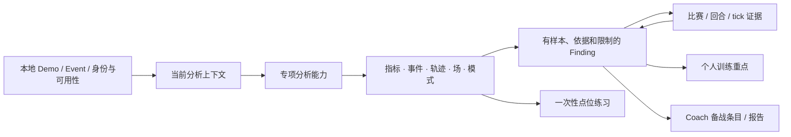

# DAK Studio 最终产品审核与一体化重做方案

- 审核日期：2026-07-11
- 审核对象：`01-current-product-reality.md` 至 `06-target-product-architecture.md`
- 证据顺序：01–03 的运行态与任务走查优先；04、04b、05、06 均视为待审核方案；必要处定向核对当前实现和 `cs2-demo-format → core → cohort → presentation → Studio` 管线
- 本文地位：取代 05/06 的产品结论，作为本次连续重做的最终产品真相源；不包含具体视觉稿，也不按版本或发布时间拆分

> **最终裁决：** 06 找对了产品缺失的中间层，但把一个个人维护的本地分析工具设计成了带版本树、知识生命周期和审计语义的工作流系统。应保留 Analysis Frame 的核心原则，删除 Frame 对象化、Claim/Finding 状态机和通用 Action Artifact，把目标压缩为：**一个轻量、可感知的分析上下文；一种带来源与返回能力的证据链接；一种有样本、依据和限制的分析发现；三类具体行动产物——个人训练重点、Coach 备战材料与已保存点位。**

## 1. Final Audit

### 1.1 对 06 的总评

06 不是错误方向，但不能直接批准为实施架构。

它正确回答了四个根问题：

1. 当前 `CohortScope`、选手选择、队伍透镜和 Coach 己方/对手选择不能继续由各页自行解释；
2. 比赛工作台应是证据查看器，但查看证据不应抹掉来源问题；
3. Event/Series/Match 的用户领域关系必须与 package、下载、重建、存储等数据运营分开；
4. 现有指标的成熟度不一致，不能把所有聚合、热图和模式都包装成自动结论。

它也保护了两项已验证价值：专家可以直接进入专项能力；Coach 的模式、代表回合、清单和报告不应被推翻。

问题在于，06 把这些原则展开成了五层 owner、Frame revision/branch、readiness snapshot、Observation/Claim/Finding 多阶段状态、Review outcome、Finding 历史状态和通用 Action Artifact。01–03 证明了“上下文丢失”和“发现无法交给行动面”，没有证明用户需要管理分析版本、否决历史、知识替代关系或通用任务对象。

因此，本次裁决是：

- **保留 Analysis Frame Workbench 作为交互模型；**
- **不保留 06 的完整对象与状态架构；**
- **把 Analysis Frame 改成轻量的 `AnalysisContext`，不是可保存、分支、恢复的业务对象；**
- **把 Observation、Claim、Finding 压成“页面数据 + 有证据的 Finding”两层；**
- **把 Action Artifact 删除为通用产品对象，只保留具体产物。**

### 1.2 Analysis Frame Workbench 是否仍是最合适的模型

是，但只在以下含义下成立：

> 用户可以从“我、某个选手、某支队伍、某个赛事、某场比赛或某个对手备战关系”开始，带着同一分析上下文进入对枪、经济、道具、动线、控图和战术能力；专项能力不再要求重复选择对象，也不能私自改变样本口径。

这比纯能力控制台更能解决个人和队伍的跨能力连续性，比对象工作空间更能表达 `我方 × 对手 × 备战目标`，又比任务卷宗轻得多。它仍是 01–03 证据下最合适的中间模型。

但 **Analysis Frame 不应成为用户要理解或管理的产品名词**。用户看到的应是类似：

> FURIA · Cologne 7 场 · 对比赛事基线 · 队伍分析

而不是 frame id、revision、parent、branch、readiness snapshot 或 saved brief。对用户而言，这只是“我现在在分析谁、用哪些比赛、和谁比、为了什么”。

### 1.3 06 中应保留的核心判断

| 06 的判断 | 最终裁决 | 保留方式 |
|---|---|---|
| Corpus、Focus、Baseline、Role/Goal 必须分开 | **保留** | 进入轻量 `AnalysisContext`；Team 不再同时隐含“筛比赛、分析主体、比较对象、对手” |
| Capability 不应拥有全局 scope/subject | **保留** | 专项页只拥有局部筛选、排序和播放状态；共同上下文由 Studio 外壳持有 |
| Evidence Review 不应替换原分析 | **保留** | 证据跳转带来源 Finding 和返回 continuation；比赛/回放只临时查看证据 |
| 普通浏览不应自动持久化 | **保留** | 页面指标与 Finding 默认临时；只有“加入训练重点/备战清单/保存点位”才写本地数据 |
| Event 领域对象与 package/import 分离 | **保留** | Events 负责领域浏览与发起分析；Library 负责数据获取；Management 负责身份、存储与修复 |
| Readiness 应按能力说明 | **保留并简化** | 只需 `ready / partial / unavailable`、有效样本数、缺失原因和修复入口；不做历史 snapshot/revision 系统 |
| 不得把描述、相关和聚类写成因果或处方 | **保留** | 作为每项能力的产品承诺边界和验收门槛 |
| Match/Replay 是统一 Evidence resolver | **保留** | 同时也是独立单场分析能力；两种进入方式必须可区分 |
| Coach 应接收外部专项分析结果 | **保留** | 通过具体 `PrepItem` 交接，不通过通用 Finding 仓库或 saved brief 平台 |
| 专家可以直接进入专项能力 | **保留** | 直达时用当前上下文或合理默认值即时开始，不要求先建对象、case 或 brief |

### 1.4 应删除或简化的过度设计

#### Analysis Frame：保留语义，删除对象生命周期

删除以下要求：

- frame identity、revision、parent、branch；
- draft、create/inherit/refine/rebind/reset/end/save/resume 的正式状态体系；
- resolved corpus snapshot 和 readiness snapshot 的历史固化；
- 一个 active root Frame 及其分支约束；
- saved brief 作为通用持久化对象。

最终只保留一个当前 `AnalysisContext`：

- `goal`：个人复盘、选手理解、队伍分析、赛事分析、单场复盘、己方复盘、对手备战或自由探索；
- `corpus`：Event/Match/地图/标签/手工排除所解析出的当前比赛集；
- `focus`：self、Player、Team、Event、Match 或整体范围；
- `roles`：仅关系任务需要 beneficiary/opponent/comparison；
- `baseline`：当前语料、赛事同侪、个人历史、指定对照或仅描述；
- `availability`：当前能力的有效样本和缺失原因。

上下文被替换、细化或清空即可，不需要版本树。只有写入具体训练重点或备战条目时，才把当时的可读上下文摘要和样本口径一并保存。

#### Observation、Claim、Finding：压成两层

06 的五段知识生命周期应删除。最终只保留：

1. **页面数据/观察**：指标、排名、轨迹、场、聚类和事件；不需要统一对象，不持久化；
2. **Finding**：当产品或用户明确说出“发生了什么、为什么值得看”时形成，必须带样本/分母、基线、证据或依据、限制和来源能力。

`Claim` 不再作为独立对象；它只是 Finding 中的结论句。`Evidence Review` 不再有 supports/contradicts/inconclusive 等强制状态。用户可以看证据、返回、修改备注或决定加入行动材料，但不需要维护 rejected/superseded/closed 等知识状态。

这不降低可信度。可信度来自清楚的口径、证据理由和限制，不来自状态机。

#### Evidence：保留为连接合同，不建设证据库

Evidence 是真正必需的产品概念，但只需两部分：

- **证据引用**：match、round、tick，可选具体事件/区域，以及“为什么这段与当前 Finding 有关”；
- **返回 continuation**：来源页面、来源 Finding/行、原分析上下文和需要恢复的局部位置。

Evidence 不需要独立 id、持久化集合、复核历史或万能收藏。当前 `MatchDeepLink` 只持有 round/tick；定向核验同时确认 `MatchWorkspace` 已能在收到 target 后直接切到对应回放。因此本次重做的核心缺口已不是“能否落到 R12”，而是**到达后仍知道为什么看 R12，并能回到原 Finding**。

#### Action Artifact：删除通用基类

06 要求所有持久化行动产物都引用 Finding，并把个人训练、备战、报告和练习素材纳入一个投影体系。这在理论上整齐，实际会制造无价值的通用存储层。

最终只保留三种具体动作：

- `TrainingFocus`：个人训练重点，保存结论、样本、证据、用户备注和复查条件；
- `PrepItem`：Coach 备战条目，保存对手/我方、地图/阵营、发现、证据和备注；
- `PracticeLineup`：用户明确保存的道具练习素材；一次性复制命令或进游戏不保存。

报告是 `PrepItem[]` 和当前 Coach 分析摘要的导出视图，不是第四种通用知识对象。现有 `PlaylistItem` 应升级为 `PrepItem`，无需先落一个全局 Finding store。

#### Readiness 与成熟度：保留闸门，删除审计系统

06 的 F/D/C/O/X 分类适合作为本次审核的分析工具，不适合作为每条结果都要持久化的运行时 ontology。运行时只需：

- 当前能力能否运行；
- 实际用了多少场/回合；
- 哪些比赛因 facts、replay、shots 或 `.tri` 缺失而未进入；
- 结果是描述性数据、系统可提出的 Finding，还是只能由用户解释的观察；
- 如何修复。

持久产物保存生成时的可读样本口径即可，不建设历史数据刷新、旧结论 supersede 或审计回放系统。

### 1.5 06 应补充的遗漏

#### 必须有稳定的 Team Overview，而不只是共享 Frame

03 的队伍任务不只是在专项页间丢失 FURIA。用户还缺少一个回答“这支队伍整体有什么特点、哪些维度值得继续看”的上层页面。06 让 Tournament、Economy、Duel、Utility、Control 共享 Frame，但仍把综合与排序留给用户。

目标产品必须明确一个 **Team Overview**：

- 展示当前队伍在所选语料和基线下的样本、阵容、地图、攻防、经济、首杀/对枪、道具、控图和开局模式摘要；
- 只做跨能力编排，不复制计算；
- 每块说明当前能交付的是描述性观察还是有证据的 Finding；
- 把用户带到对应专项能力，并保持同一上下文；
- 不自动编造“强项/弱项”或备战对策。

这是 01–03 的直接缺口，不是可选的 UI polish。

#### 必须裁决当前页面，而不是继续留给后续 IA

06 明确说“不承诺页面数量和容器形状”，这使它无法直接进入一次连续重做。最终方案必须做出以下裁决：

- 删除“赛事与队伍”作为同时混合排行榜、赛事总览和赛事合集的容器；
- 建立独立的 Event 浏览/总览与 Team Overview；
- 把完整排行榜放在 Event/Player 分析体系中，不再让它成为容器默认落点；
- 合并“对枪复盘 / 对枪概览”为同一对枪能力的不同视图；
- 保持“道具价值 / 道具点位”分离，分别负责贡献评估与练习复现；
- 保持控图为专家可直达的描述性专项能力，同时允许人工把观察带入 Coach；
- 把“战术本”并入模式命名与备注，因为当前实现只是 cluster 命名存储，并不是完整战术库；
- 战术板不属于本次重做。

#### 允许用户从 observation-only 能力形成手工 Finding

06 的成熟度闸门容易被实现成：RadarField、赛事聚合等 O 级能力不能进入 Finding/Coach。这个结论过严。

正确边界是：

- 系统不能把没有验证规则的覆盖场自动写成“弱区”；
- 用户可以在看完覆盖场后手工写“de_inferno B 区 1:00 后覆盖偏低，需复核”，并把当前图、样本口径和选定回合附入备战条目；
- 该条目必须标明“用户判断”，不能伪装成算法结论。

这既保护算法边界，也不阻断真实教练工作。

#### 个人“训练”必须降为训练重点，而非自动处方

当前首页的 Mistake Review 能证明“长枪局首死 3/39，最近证据是 R12”，不能单独证明成因，也不能从 demo 自动推导最合适的训练方法。目标产品应把“本周该练什么”改为更诚实的“优先复盘 / 训练重点”：

- 系统可以按稳定规则提出需要复盘的行为；
- 用户看证据后确认、修改或忽略；
- 训练方法来自用户填写或经过明确维护的静态建议映射；
- 不承诺自动诊断原因或生成个性化训练处方。

### 1.6 仍需修正的矛盾

| 06 中的矛盾 | 最终修正 |
|---|---|
| Frame 默认 ephemeral，却强制 id/revision/parent/snapshot/persistence | Frame 改为普通当前上下文；持久化只发生在具体行动条目 |
| 不希望普通浏览任务化，却引入 Claim review、Finding tracking/accepted/rejected/superseded/closed | 删除知识状态机；用户只决定是否加入具体训练或备战材料 |
| 不建立万能 action sink，却要求所有行动都先投影自统一 Finding | 不建通用 sink，也不建全局 Finding store；具体条目直接保存来源摘要和证据 |
| Capability local state 不进入 Frame，却要求每个 Observation 保存 local parameter snapshot | 普通观察不对象化；只有 Finding/行动条目保存影响结论的关键参数 |
| 报告不能复制/重解释 Finding，但当前 Coach 报告本来就是对 cluster 的自动编排 | 报告允许组合当前模式摘要与用户选择的 PrepItem，并明确两类来源 |
| 领域目录假设稳定 Team identity，但当前跨场队伍主要依赖名称和人工归并 | 目标只承诺“经身份归并后的本地队伍身份”；不承诺 roster-aware 的历史队伍实体 |
| 06 说目标职责不等于当前能力，却仍用完整 Claim 生命周期描述所有能力 | 每项能力只实现它当前支持的输出上限；无证据策略的页面保持观察面 |

### 1.7 底层数据与算法支持边界

定向核验支持 06 对分析成熟度的大部分判断，但需要用更直接的产品语言收束：

| 能力 | 当前真实支持 | 本次重做允许承诺 | 明确不属于本次重做 |
|---|---|---|---|
| 个人 Mistake Review | 首死/残局等规则统计，带 match/round/tick 与 detail |  evidence-backed 复盘 Finding、返回原问题、加入训练重点 | 自动判断根因、自动训练处方 |
| Duel / Mechanics | 对枪分类、首杀、TTK、急停/首发等；部分依赖 shots/replay/`.tri` | 有 coverage 的对枪观察与证据 Finding | 缺数据时横向硬比；把 null 当 0 |
| Economy / Tournament | 手枪、经济档、人数优势和转化的描述性聚合 | 明确分母、队伍/赛事摘要、可进入具体回合的部分指标 | 自动断言“显著更强”、完整通用反例/证据策略、因果解释 |
| Utility Value | HE/火/闪/烟事件与贡献，部分有具体 grenade/round | 贡献评估、最佳/最差事件证据 | “这颗道具导致胜负”、自动生成最佳 lineup 或战术建议 |
| Lineup | 出手/落点聚类、回放、练习姿态、命令与进游戏 | 查找、复现、一次性练习、用户保存点位 | 自动判断点位最优或战术有效 |
| RadarField | 赛事地图基线、队伍贡献/差分、时间化描述性场 | 专家观察、样本/coverage、用户手工形成备战判断 | 自动弱区检测、成因解释、代表回合抽取、MapControl 评分 |
| Tactical Cluster | 默认位/开局结构、经济分类、进点 evidence、代表回合、胜率/下包率 | 开局/execute 模式观察、证据、清单与报告 | 完整 mid-round 战术、意图识别、佯攻/转点自动判断、最佳对策 |
| Team synthesis | 基础队伍比较、赛事/经济聚合、各专项能力分散输出 | Team Overview 编排现有数据并保持上下文 | 自动跨能力排序“核心强弱项”、统计显著性、教练对策生成 |
| Event / identity | Studio Event/Series 组织、手工/名称归并、package 导入 | 本地领域浏览、语料选择、来源与可用性说明 | 把 v3 当成原生跨场 Team/Event 真相源；完整 roster 历史 |

关键实现证据：

- 当前 App 把 `view`、`selectedDemoId`、`selectedPlayerKey`、`scope` 和只含 round/tick 的 `matchDeepLink` 分开持有：[`App.tsx`](../../../apps/dak-studio/src/App.tsx)；
- `CohortScope` 明确把 event/map/tag/excludedIds 当语料，把 team 当行级透镜：[`CohortScope.tsx`](../../../apps/dak-studio/src/components/CohortScope.tsx)；
- 首页 `PracticeCard` 只有 label、count 和单条证据，尚不是训练诊断对象：[`HomeView.tsx`](../../../apps/dak-studio/src/views/HomeView.tsx)；
- 当前证据 target 已能让比赛工作台直接切到对应回放，但没有来源 Finding 与返回 continuation：[`MatchWorkspace.tsx`](../../../packages/react/src/components/MatchWorkspace.tsx)；
- 当前 `PlaylistItem` 只保存 group、match、round、cluster/fingerprint 与 note，证明 Coach 需要的是具体条目升级，不是通用知识库：[`playlist.ts`](../../../apps/dak-studio/src/lib/playlist.ts)；
- RadarField 页面只交付描述性场、基线和队伍贡献，没有 finding detector：[`RadarFieldView.tsx`](../../../apps/dak-studio/src/views/RadarFieldView.tsx)；
- Tactical Cluster 的稳定内容是开局结构、真实进点覆盖与代表回合，不是完整战术意图：[`tactical-clusters.ts`](../../../packages/cohort/src/tactical-clusters.ts)；
- Tournament/Team 输出主要是描述性聚合，且 `TeamCohortSummary` 合同目前没有真实 producer/consumer，不能假设已有完整 Team workspace：[`insights.ts`](../../../packages/presentation/src/insights.ts)、[`team.ts`](../../../packages/presentation/src/team.ts)、[`contract/team.ts`](../../../packages/contract/src/team.ts)。

### 1.8 最终审核结论

06 **不应按原样实施**。它对产品问题和数据边界的判断可以保留，但其对象体系、状态机、持久化和历史审计设计应删除。

最终批准的产品模型是：

> **有上下文的证据型分析工作台。** 当前分析上下文让个人、选手、队伍、赛事和对手关系跨专项能力保持一致；有结论时用 Finding 把样本、依据、证据和限制说清；比赛/回放负责验证并返回；只有用户明确选择时，结论才进入个人训练重点或 Coach 备战材料。

这仍可称为 Analysis Frame Workbench，但 `Analysis Frame` 只是一份轻量运行时合同，不是产品对象、知识卷宗或持久化系统。

## 2. Final Target Product

### 2.1 产品本质

DAK Studio 是一个**本地、证据优先的 CS2 demo 分析工作台**。

它把一批本地 demo 组织成可解释的个人、选手、队伍、赛事和单场分析，让用户从统计现象或模式进入具体回合/时刻验证，再把真正有用的结论变成个人训练重点或对手备战材料。

它不是：

- 通用数据看板；
- 项目管理、知识库或案例系统；
- 自动教练或战术 AI；
- 赛事运营平台；
- 多人协作、权限、审批或云同步产品。

### 2.2 核心用户任务

产品只围绕五类真实任务组织：

1. **复盘我自己**：最近发生了什么，哪些行为最值得先看，证据在哪，确认后要练什么；
2. **理解一个选手**：在当前样本中呈现什么画像、趋势、机制和失误证据；
3. **理解一支队伍或一个赛事**：先得到整体盘面，再沿经济、对枪、道具、控图和开局模式继续分析；
4. **复盘一场比赛**：查看回合、经济、对位、地图与 2D 回放，也是所有跨场发现的证据落点；
5. **准备己方复盘或对手备战**：把多项分析中的可靠发现和代表回合放进清单，形成可读报告。

专家用户还有一条同等重要的快捷路径：**直接进入对枪、经济、道具、动线、点位、控图或战术模式等专项能力**。产品为其补齐默认上下文，但不强迫先进入主页、对象页或建立任务。

### 2.3 最小产品模型

最终产品只需要四个共同概念：

| 概念 | 用户语言 | 产品职责 | 不做什么 |
|---|---|---|---|
| `AnalysisContext` | 当前在分析谁、哪些比赛、和谁比、为了什么 | 让对象、语料、角色和基线跨能力保持一致 | 不保存版本树，不成为项目或 case |
| `Finding` | 一个值得继续看的结论 | 说清现象、样本/分母、基线、证据/依据和限制 | 不维护 accepted/rejected 等状态，不建立全局仓库 |
| `EvidenceRef + Continuation` | 为什么看这个回合，以及看完回哪里 | 定位 match/round/tick 并恢复来源问题和局部位置 | 不建立证据收藏库或复核审计 |
| 具体行动条目 | 训练重点、备战条目、已保存点位 | 只在用户明确操作时持久化 | 不抽象为通用 Action Artifact |

工作链只有一条：

### 2.4 AnalysisContext 的实际行为

AnalysisContext 不是一个新页面，而是所有分析页面共享的一句话上下文。

规则如下：

1. **语料和分析对象分开。** “Cologne 7 场”说明样本；“FURIA”说明分析对象；两者不能再由一个 Team chip 模糊表达。
2. **关系只在需要时出现。** 中立队伍分析只需 focus team；对手备战才需要 beneficiary + opponent。
3. **基线必须可读。** 例如赛事全部队伍、个人历史、指定队伍或仅描述；没有基线时不假装比较。
4. **跨能力只继承共同语义。** 对枪页的武器筛选、控图页的 field source、回放 tick、表格排序仍是局部状态。
5. **查看证据不改变原上下文。** 只有用户明确开始独立复盘该场比赛时，才替换成单场上下文。
6. **开始无关分析时直接替换上下文。** 不建 branch，也不要求保存旧 session。
7. **专家直达时即时补默认值。** 有“这是我”就可形成个人上下文；有全局语料就可形成整体探索；缺必需对象时只询问该对象。

### 2.5 Finding 与证据

Finding 是产品敢于对用户说出的分析结论，不是每个数字的包装。

一个 Finding 至少回答：

- 发生了什么；
- 描述谁或哪种关系；
- 使用了哪些场次/回合和什么基线；
- 样本量、分子/分母或覆盖是多少；
- 哪些回合、事件或聚合依据与它有关；
- 为什么这些证据相关；
- 当前结论的限制是什么；
- 由哪项能力或用户判断产生。

系统只对已有稳定规则和证据策略的结果自动提出 Finding，例如个人 Mistake Review、具体 Duel、最佳闪光/伤害证据和 Tactical Cluster。赛事聚合、Economy 汇总和 RadarField 在缺少完整证据策略时仍可展示；用户可以据此写手工 Finding，但产品不能替用户下结论。

进入证据时，比赛工作台必须显示一条简短来源提示，例如：

> 正在复核：FalleN 在 39 个长枪局中首死 3 次 · 当前证据 de_inferno R12

用户看完后可以回到原卡片、原专项页和原局部位置。产品不要求记录“支持/反驳”状态；用户只需继续看、修改备注、忽略，或加入训练/备战材料。

### 2.6 产品主要结构

产品结构按职责分为四个区域，不要求四个区域必须对应四个视觉分组：

#### 数据与对象

- **资料库**：所有数据获取入口，包括单场 `.dem`/ZIP、赛事包、示例数据；负责本地比赛列表、标签、基础可用性、重建与打开单场。
- **赛事**：只负责 Event → Stage → Series → Match 的领域浏览、赛事总览和从赛事形成分析语料；不负责下载、package 修复或身份治理。
- **管理**：身份归并、我的身份/我的队伍默认值、存储、官方资产和修复；不再作为赛事分析或普通导入入口。

#### 对象型分析入口

- **我的复盘**：个人近期状态、优先复盘 Finding、训练重点和最近比赛。
- **选手**：长期画像、趋势、机制、道具、失误和比赛证据。
- **队伍**：稳定的 Team Overview，编排跨能力摘要并进入专项页。
- **赛事总览**：赛事范围、地图、队伍、排行榜和宏观盘面；排行榜是赛事/选手分析的一部分，不是混合容器默认首页。
- **比赛工作台**：单场完整分析与通用证据查看器。

#### 专项分析能力

- **对枪**：一个能力，包含证据复盘、整体态势和机制三个视图；不再保留两个一级产品面。
- **开局动线**：描述选手/队伍开局轨迹和具体回合，不自动解释战术意图。
- **转化与节奏**：经济、手枪、人数优势和翻盘的唯一详细 owner；队伍/赛事页只显示摘要。
- **道具价值**：HE/火/闪/烟贡献和事件证据。
- **道具点位**：点位发现、回放和练习复现；与道具贡献分离。
- **控图**：赛事基线、队伍贡献和差分的描述性空间分析；保持专家直达，不伪装成自动弱区诊断。
- **战术模式**：开局/execute 聚类、代表回合和模式命名；主要在 Coach 中消费。

#### 行动与输出

- **个人训练重点**：我的复盘中的轻量本地清单，不单独建设任务中心。
- **Coach**：己方复盘/对手备战关系、开局模式、地图池、备战清单和报告；接受来自对枪、经济、道具、控图和点位的 Finding 或用户备注。
- **一次性动作**：进游戏、复制练习命令、导出当前报告可以直接执行，不强迫保存。

### 2.7 当前页面在目标产品中的定位

| 当前页面/区域 | 最终定位 | 处理 |
|---|---|---|
| 我的主页 | 我的复盘入口、个人 Finding 与训练重点摘要 | **保留并重构**；与选手档案共享模型，不复制长期画像 |
| 资料库 | 所有 demo/event package 的数据获取、目录和基础 availability | **保留并扩责**；接管普通赛事包获取/导入入口 |
| 比赛工作台 | 单场分析 + 通用 Evidence resolver | **保留并重构**；加入来源提示和准确返回 |
| 选手档案 | 选手长期分析 | **保留**；选择选手时更新共同上下文 |
| 开局动线 | 描述性 Opening Trails capability | **保留**；不与 Coach pattern 合并 |
| 对枪复盘 / 对枪概览 | 同一 Duel capability 的证据、态势、机制视图 | **合并产品面**；可保留共享实现 |
| 赛事与队伍容器 | 不再作为目标产品容器 | **删除**；拆为 Events、Event Overview、Team Overview |
| 排行榜 | 当前赛事/语料下的选手比较 | **降为对象分析视图**；不再是赛事容器默认落点 |
| 赛事总览 | Event Overview 与 Team Overview 的现有数据来源 | **拆责重构**；宏观摘要不重复专项详情 |
| 赛事合集 | Event 领域目录 | **保留能力、改变边界**；不处理 package 生命周期 |
| 转化与节奏 | Economy/Conversion 详细 owner | **保留**；赛事/队伍只引用摘要和深链 |
| 道具价值 | Utility contribution | **保留**；不与点位库合并 |
| 道具点位库 | Lineup discovery + practice gateway | **保留**；允许一次性练习和具体保存 |
| 控图 | 描述性 Spatial capability | **保留**；可进入 Team/Coach，但不自动产弱区 Finding |
| 教练工作台 | Coach 备战闭环与具体持久产物 | **保留并重构**；接收全产品 Findings/备注 |
| 战术本 tab | cluster 命名与注释 | **并入战术模式**；不再暗示完整战术库 |
| 管理 | 身份、存储、官方资产与修复 | **保留并收窄**；移出普通赛事获取/分析 |
| 战术板 | 无 01–03 证据支持的新增面 | **删除出本次目标** |

### 2.8 页面和能力如何协作

对象型入口负责回答“先看什么”，专项能力负责回答“具体发生了什么”，比赛工作台负责回答“证据在哪里”，行动面负责回答“我准备怎么处理”。

协作规则：

- 我的复盘、选手、队伍、赛事只编排摘要和优先入口，不复制专项计算；
- 进入专项能力时继承当前 AnalysisContext；
- 专项能力返回页面数据或 Finding；
- 所有可证据化结果使用统一 EvidenceRef；
- Match/Replay 读取 target 和来源 continuation；
- 返回后恢复同一 Finding 和页面状态；
- “加入训练重点”“加入备战”把 Finding 摘要和证据写入具体产物；
- 没有系统 Finding 的观察也可由用户写备注后加入 Coach，并标为用户判断。

### 2.9 从现象到训练或备战材料的完整流程

#### 个人复盘

1. “我的复盘”用 self 默认值和近期比赛形成上下文；
2. 页面展示状态摘要和有稳定规则的优先复盘 Finding；
3. 用户进入对枪、动线或比赛证据，仍保留原问题；
4. Match/Replay 定位具体回合/tick，并显示证据理由；
5. 返回原 Finding 后，用户忽略、修改备注或加入训练重点；
6. 训练重点保存结论、证据、样本和复查条件，不声称自动知道根因。

#### 队伍理解

1. 用户从 Team Overview 选择 FURIA；
2. 上下文明确显示当前比赛集、FURIA focus 和赛事/历史基线；
3. Team Overview 给出地图、阵容、经济、对枪、道具、控图、开局模式摘要；
4. 用户进入任一专项能力，无需重选队伍或语料；
5. 专项页可查看证据并返回；
6. 普通理解可以到此结束，不产生任务；若转为对手备战，显式补上我方和 opponent 关系进入 Coach。

#### 对手备战

1. Coach 上下文明确 beneficiary、opponent、语料和基线；
2. 用户查看开局模式、地图池，也可进入对枪、经济、道具和控图；
3. 有系统 Finding 时直接加入备战；只有观察时先写用户判断和备注；
4. 每个 PrepItem 保存地图/阵营、结论、样本、证据、来源和备注；
5. 用户可随时回放代表回合并返回原条目；
6. 报告组合已选 PrepItem、开局模式摘要、地图池和 coverage/限制，不生成未经验证的对策。

#### 专家直达

1. 用户直接打开对枪、经济、道具、点位或控图；
2. 页面消费现有上下文，或用全库/当前 Event + descriptive baseline 建立即时上下文；
3. 用户完成探索、查看证据或执行一次性动作；
4. 没有明确“加入”时不创建任何持久对象。

### 2.10 明确不属于产品目标

以下内容不属于本次重做，也不应被包装成遥远产品阶段：

- Analysis Frame/Finding 的版本树、历史审计、审批、协作、评论、权限与云同步；
- 通用 case、brief、任务中心、知识库、收藏夹或 Action Artifact 平台；
- 自动训练处方、自动根因分析和个性化训练计划生成；
- 自动弱区检测、MapControl 正式评分、UtilitySpatial 因果效果；
- 自动判断战术意图、佯攻/转点、完整 mid-round plan 或最佳反制策略；
- 无统计验证的“显著强于”、自动跨能力强弱项排名或胜负因果解释；
- roster-aware 的完整队伍历史实体与跨平台身份系统；
- 战术板、实时协作和复杂战术编辑器；
- 托管赛事运营、账号、付费、权限和多人交付工作流。

## 3. Integrated Redesign Plan

本计划描述一次连续实施的完整边界。排列顺序只表示技术依赖和可独立提交的语义单元，不表示产品阶段、版本、优先级或发布时间。全部工作完成后才达到第 2 部分定义的最终形态。

### 3.1 完整工作范围

#### 保留

- `.dem → v3 ZIP → core/cohort/presentation → Studio` 的现有模块边界；
- v3 ZIP 作为跨语言唯一 seam；
- 当前 demo/facts/identity/Event/Series 本地存储接缝；
- 我的主页、选手档案、比赛工作台、开局动线、经济、道具价值、点位、控图和 Coach 的有效分析能力；
- `CohortScope` 已证明有效的语料选择：Event、地图、标签、排除场次；
- Match/Replay 的 round/tick 精确定位和“进游戏”能力；
- Coach 的 Tactical Cluster、模式命名、代表回合、playlist 和 Markdown 导出；
- Lineup 的练习姿态、命令、回放和进游戏；
- 现有 facts-on-import、懒加载单场模型、RadarField 缓存和资产自愈入口；
- `@cs2dak/core` 的纯分析、`@cs2dak/cohort` 的跨场聚合、`@cs2dak/presentation` 的产品中立 View Model 所有权。

#### 删除

- “赛事与队伍”混合容器及其默认排行榜落点；
- “对枪复盘 / 对枪概览”两个独立产品入口；
- 作为独立产品承诺的“战术本”tab；
- 管理页中的普通赛事获取/导入入口；
- 各页私有且与共同上下文重复的 scope、subject、team selection；
- 把 Team chip 同时当筛选器和透镜的含糊交互；
- 无证据策略却以诊断、弱区、训练建议或战术结论表述的 copy；
- 05/06 中 Frame revision tree、Claim/Finding 状态机、saved brief、通用 Action Artifact 和全局 Finding store 的实施要求；
- 战术板及为其预留的导航/合同；
- 重做完成后不再被使用的旧 state adapters、兼容组件、旧导航 key 和重复缓存。

#### 重构

- App 当前 `scope + selectedPlayer + Coach settings + matchDeepLink` 的分散状态，收敛为一个当前 `AnalysisContext` 加页面局部状态；
- `CohortScope`，拆分为“语料范围”和“分析对象/关系/基线”的明确表达；
- `EvidenceActions`、MatchView、MatchWorkspace 和 Replay 的调用链，补齐来源、理由和返回 continuation；
- Home 的“本周该练什么”，改为 evidence-backed “优先复盘 / 训练重点”；
- TournamentDashboard/Leaderboard/Events 的职责，拆成 Event Overview、Team Overview 和 Event Directory；
- Duel 的两种 variant，收敛为一个 capability 内的不同视图；
- Coach 的 team/mode state，改为消费对手备战/己方复盘上下文；
- `PlaylistItem`，升级为能接收跨能力 Finding/用户判断的 `PrepItem`；
- Coach 报告，组合模式摘要、地图池、PrepItem 与 coverage/限制；
- Library/Events/Management 的入口和空态跳转，使获取、浏览、修复各有唯一 owner；
- 每项能力的缺失数据处理，使 ready/partial/unavailable 和实际样本可见。

#### 新增

- 轻量 `AnalysisContext` 及 resolver/summary；
- 稳定 Team Overview；
- Event Overview 与 Event Directory 的明确边界；
- 通用 `EvidenceRef` 和 Studio `EvidenceContinuation`；
- 最小 `AnalysisFinding` 展示合同；
- `CapabilityAvailability`；
- `TrainingFocus` 本地清单；
- 跨能力 `PrepItem`；
- 来源提示、返回原 Finding 和恢复来源位置的交互；
- 个人、队伍、赛事、对手备战和专家直达的端到端产品测试。

### 3.2 共享产品合同

以下合同必须先建立，但应放在正确 owner，不能因为“统一”全部塞进 `@cs2dak/contract`。

#### A. Studio `AnalysisContext`

Owner：`apps/dak-studio`。它包含产品路由、用户目标和本地身份关系，不属于通用 presentation View Model。

最小字段：

| 字段 | 内容 |
|---|---|
| `goal` | explore、personal-review、player-analysis、team-analysis、event-analysis、match-review、own-review、opponent-prep |
| `corpus` | eventIds、matchIds/规则、maps、tags、excludedEntryIds；统一 resolver 得到当前 entries |
| `focus` | aggregate、self/player、team、event 或 match；使用稳定本地引用 |
| `roles` | 可选 beneficiary、opponent、comparison；只在关系任务使用 |
| `baseline` | corpus、event peers、personal history、指定对象或 descriptive |

不包含：id、revision、parent、branch、persistence、tab、sort、tick、播放速度和组件状态。

配套纯函数：

- 从入口/default settings 创建上下文；
- 解析 corpus；
- 切换 focus/goal/roles；
- 生成用户可读摘要；
- 判断某能力缺少哪些必需坐标；
- 区分替换当前分析与仅打开证据。

#### B. 共享 `EvidenceRef`

Owner：若 core/cohort/presentation 多层都需要产生，定义于 `@cs2dak/contract`；具体 Finding 文案与选择策略仍归 presentation。

最小字段：

- `matchId`；
- `roundNumber`；
- 可选 `tick`；
- 可选事件/区域 key；
- `reason`：为什么这段与结果相关；
- 可选 `role`：`example`、`supporting`、`counterexample`，只在算法真能区分时填写。

现有 `MistakeEvidence`、`DuelEvidence`、Utility evidence、Tactical representative round 逐步适配到该合同；不要求底层原始事实都改造成 EvidenceRef。

#### C. Presentation `AnalysisFinding`

Owner：`@cs2dak/presentation` 负责系统生成的产品中立 Finding；Studio 负责用户手工 Finding 的适配。

最小字段：

- 稳定的 capability-local key；
- `title` 和 `statement`；
- subject/relationship 的可读引用；
- 样本、分子/分母、coverage 和 baseline 摘要；
- `evidence[]` 或 aggregate basis；
- limitations/qualifiers；
- producer/capability version；
- `origin: system | user`。

不包含：accepted/rejected/tracking/superseded、行动状态、页面位置和持久化方法。

系统 Finding adapter 只为当前有可靠规则的能力建立：Mistake Review、具体 Duel、可证据化 Utility 事件、Tactical Cluster。其它能力先继续输出原 View Model；用户可以从其观察写手工 Finding。

#### D. Studio `EvidenceContinuation`

Owner：`apps/dak-studio`，因为它含 Studio view 和局部恢复信息。

最小字段：

- 来源 view/capability；
- 当前 AnalysisContext；
- Finding 或来源行 key；
- 需要恢复的最小局部状态，如 tab/filter/selected item/scroll anchor；
- EvidenceRef target。

它只存在于当前导航历史；不写数据库，不成为 Review Context 对象。

#### E. `CapabilityAvailability`

Owner：资格判定所需事实归各能力，Studio 负责汇总和展示。

最小字段：

- `status: ready | partial | unavailable`；
- eligible/total match 或 round 数；
- excluded reasons；
- optional dependencies，如 replay/shots/`.tri`；
- 可修复动作；
- output level：`observation` 或 `system-finding`。

它不保存历史 snapshot。写入 TrainingFocus/PrepItem 时，只保存当时的可读 coverage 和必要版本。

#### F. 具体持久产物

Owner：Studio 本地产品层。

`TrainingFocus`：

- player/self；
- Finding snapshot；
- evidence；
- user note；
- review condition；
- createdAt。

`PrepItem`：

- beneficiary/opponent；
- map/side 可选；
- Finding snapshot 或 user-authored statement；
- evidence；
- source capability；
- note/group；
- coverage/limitations；
- createdAt。

`PracticeLineup` 继续使用点位专属字段。三个 store 不共享通用基类，只共享 `EvidenceRef` 和可读来源摘要。

#### G. Facts 与持久化边界

`facts` 是从已持久化的 v3 ZIP / DemoPackage 派生、按比赛组织的物化分析缓存。它服务跨场查询和页面性能，不是用户数据，也不是产品知识库。

边界如下：

- facts 必须可以安全删除，并通过现有 ZIP 重新构建；不要求重新取得原始 `.dem`；
- Team Overview、Economy、Duel、Utility、Tactical 等需要的紧凑逐场分析材料，可以继续扩展现有 facts 体系，而不是由页面重新解析 ZIP 或另建平行缓存；
- `AnalysisContext`、`EvidenceContinuation` 和页面局部状态属于运行时状态，不进入 facts；
- `AnalysisFinding` 是 presentation 层生成的展示合同，默认由 facts + 当前 `AnalysisContext` 即时形成；不建设全局 Finding 缓存或数据库；
- `TrainingFocus`、`PrepItem`、`PracticeLineup` 是用户明确创建的数据，必须使用独立 storage namespace；它们可以复用同一个 `StorageAdapter`，但不得与 facts 共用删除、重建、stale 或版本迁移生命周期；
- 删除或重建 facts 不得删除、覆盖或失效用户保存的训练重点、备战条目和点位；用户数据若因来源比赛缺失而无法打开证据，只标记证据不可用，不随缓存清理级联删除。

因此，facts 的版本变化继续通过现有 analysis manifest / fact version 触发重建；用户数据只在自身 schema 确实变化时做独立迁移。二者不能为了实现方便合并成同一个持久化对象体系。

### 3.3 模块所有权

| 模块 | 本次新增/调整 owner | 明确不得拥有 |
|---|---|---|
| `@cs2dak/contract` | 多包共用的 EvidenceRef 等纯数据合同 | Studio goal、导航 continuation、训练/备战本地状态 |
| `@cs2dak/core` | 继续提供单场事实与确定性分析；必要时补具体 evidence extraction | 产品 Finding 文案、用户目标、持久化 |
| `@cs2dak/cohort` | 继续提供身份归并与跨场聚合；补 Team Overview 所需的真实聚合接缝 | 页面编排、Coach 状态、系统训练建议 |
| `@cs2dak/presentation` | Team/Event View Model、系统 Finding adapter、证据理由和口径呈现 | 数据库、路由、当前上下文、任务状态 |
| `@cs2dak/react` | 渲染 context summary、Finding、evidence source/return 等纯组件 | 查询、分析、存储、上下文 owner |
| `apps/dak-studio` | AnalysisContext、目录/readiness 编排、continuation、TrainingFocus/PrepItem、页面协作 | 复制分析公式或共享聚合逻辑 |

### 3.4 页面职责改造清单

| 目标区域 | 需要完成的职责改造 | 依赖 |
|---|---|---|
| App shell | 持有一个 AnalysisContext；显示可读上下文；区分共同上下文与局部状态 | Context contract |
| 我的复盘 | 使用 self preset；输出可证据化 Finding；维护 TrainingFocus 摘要 | Context、Finding、Evidence continuation |
| 资料库 | 统一单场和赛事包获取；显示基础数据/能力可用性；发起单场/Event 分析 | Availability、Event directory |
| 比赛工作台 | 独立单场分析或证据 review；显示来源 Finding；准确返回 | Evidence continuation |
| 选手 | 以 Player context 工作；不复制 Home 的“下一步”职责 | Context、presentation player models |
| Team Overview | 编排地图、阵容、经济、对枪、道具、控图、模式摘要；进入专项能力 | Context、team/event presentation adapters |
| Event Overview/Directory | 领域层级、赛事宏观摘要、排行榜和从 Event 发起分析 | Event records、Context、Availability |
| 对枪 | 合并 review/overview 入口；局部 view 不改变 context | Context、Duel model、EvidenceRef |
| 转化与节奏 | 成为经济/人数优势详细 owner；补可下钻回合的指标 | Tournament facts、EvidenceRef |
| 道具价值 | 保持贡献评估；统一具体事件 EvidenceRef | Utility adapters |
| 道具点位 | 保持查找/练习；保存只进入 PracticeLineup | Lineup facts、EvidenceRef |
| 控图 | 显示 baseline、focus、coverage；允许用户写手工 Finding | Context、Availability；不依赖新 detector |
| Coach | 消费 own/opponent context；接收所有 PrepItem；报告组合模式与条目 | Context、Finding、PrepItem、Evidence continuation |
| 管理 | 身份、存储、官方资产和修复；不再承担普通导入或分析 | Library/Event 边界迁移 |

### 3.5 技术依赖顺序与原子工作包

以下工作包**不是产品阶段、版本规划或 rollout**。它们只是一次连续重做中的技术依赖顺序和原子 commit 边界：每项应语义完整、可独立验证和回滚，但实施可以连续完成，不要求逐包发布、等待用户验证周期或暂停后续工作。不得把后续页面重做混进前置合同，也不得留下两套长期并行架构。

1. **共享 Evidence 与 Finding 输出合同**
   - 在正确包内建立 `EvidenceRef`、`AnalysisFinding` 和 adapter 测试；
   - 先适配 Mistake Review、Duel、Utility、Tactical 的现有证据；
   - 不改页面、不加持久化。

2. **Studio AnalysisContext 纯合同与 resolver**
   - 建立 context 类型、默认 preset、corpus resolver、focus/role/baseline 变更和摘要；
   - 用单测覆盖 Team 作为 focus 与 Team 过滤比赛的差异、Event corpus、opponent relationship；
   - 不接 UI。

3. **CapabilityAvailability 汇总**
   - 从 entry meta、builtWith/facts、replay/shots/`.tri` 和能力要求派生 ready/partial/unavailable；
   - 明确 eligible/total 与 repair reason；
   - 保留 null，不以 0 表示缺失。

4. **App 上下文 owner 迁移**
   - 以 AnalysisContext 替代 App 中语义重复的 `scope`、selected player/team 与 Coach role 传播；
   - 保留各页局部 UI state；
   - 通过短期 adapter 让现有页面继续消费 resolved entries，随后在同一工作包末删除失去用途的旧 owner state。

5. **统一上下文表达与入口 preset**
   - 让 Home、Player、Team、Event、Match、Coach 和 capability direct entry 创建/替换正确上下文；
   - 把“聚合范围”和“队伍 focus/role/baseline”分开显示；
   - 不进行具体视觉重做，只完成语义和行为。

6. **Evidence 查看与返回闭环**
   - 扩展 `EvidenceActions → App → MatchView → MatchWorkspace/Replay` 调用链；
   - 传递 Finding 摘要、reason、来源 key 和 continuation；
   - 直接定位 target，显示“正在复核什么”，返回后恢复来源卡片/过滤/选择；
   - 修正 RoundExplorer 等局部状态从证据返回时重置的问题。

7. **个人复盘与 TrainingFocus**
   - Home 只显示有稳定依据的个人 Finding 和诚实的优先复盘表述；
   - 接通 Evidence continuation；
   - 建立轻量 TrainingFocus store、添加/编辑/删除和复查条件；
   - 选手档案保留长期画像，不复制训练清单。

8. **资料库、Event 与管理职责迁移**
   - 把赛事包获取/导入与单场导入统一到资料库；
   - Event Directory 只做 Event/Stage/Series/Match 浏览和发起分析；
   - 管理收窄为身份、存储、官方资产与修复；
   - 更新空态、跳转和删除/修复边界，不复制数据入口。

9. **Team Overview**
   - 在 cohort/presentation 的正确 owner 中建立 Team Overview View Model；
   - 编排现有基础、地图、阵容、经济、对枪、道具、控图和战术摘要；
   - 保持同一 Team context 进入各专项能力；
   - 不自动生成底层不支持的强弱项或对策。

10. **Event Overview 与旧赛事容器拆除**
    - 建立 Event Overview，编排赛事宏观盘面、队伍入口和排行榜；
    - Event Directory 保留 Event/Stage/Series/Match 领域浏览；
    - 删除旧“赛事与队伍”混合容器和默认排行榜落点；
    - 保持 Team Overview、Event Overview 与 Economy 等专项页之间的摘要/详情边界。

11. **Duel 产品面合并**
    - 把对枪证据、整体态势和机制收进同一 capability 的局部视图；
    - 删除两个一级入口、两套叙事 state 和重复 scope；
    - 保持个人/队伍 goal 对默认视图的合理选择，并共享 EvidenceRef。

12. **Economy/Conversion 详情 owner 收口**
    - 让转化与节奏成为手枪、经济、人数优势和翻盘详情的唯一 owner；
    - Team/Event Overview 只保留摘要与深链；
    - 为底层已有 round 事实的指标补 EvidenceRef，无法下钻的聚合明确保持 observation。

13. **Utility 与 Lineup 边界收口**
    - Utility 只负责贡献评估和具体事件证据；
    - Lineup 只负责出手/落点发现、回放、一次性练习和 PracticeLineup；
    - 删除因同属“道具”而共享的含糊 action/导航语义；
    - 统一两者的 EvidenceRef，但不建立共同持久化模型。

14. **RadarField 产品化边界**
    - 接入 AnalysisContext 和 CapabilityAvailability；
    - 明确显示赛事基线、队伍贡献、eligible coverage 和 `.tri` 降级；
    - 标记 observation-only，提供用户手工 Finding/加入备战入口；
    - 不新增弱区 detector、代表回合算法或 MapControl 评分。

15. **Coach 跨能力闭环**
    - Coach 直接消费 own-review/opponent-prep AnalysisContext；
    - 将 `PlaylistItem` 迁移为 `PrepItem`，兼容已有本地条目并补来源/coverage 字段；
    - 让系统 Finding 和用户手工 Finding 都能加入；
    - 报告组合 Tactical 摘要、地图池、PrepItem 与限制；
    - 保持 Opening Trails 与 Tactical Pattern 的能力边界，把“战术本”tab 合入模式命名与备注。

16. **最终产品 shell、删除与文档收口**
    - 依据第 2 部分的区域职责整理最终入口；
    - 保证 Home/Player/Team/Event/Match/Coach 与专项能力均可直达；
    - 删除旧 context adapters、旧导航 key、战术板占位、无消费者合同和不再使用的持久化命名空间；
    - 同步 `studio-redesign.md`、module ownership 文档和组件登记表，使本文成为产品真相源而非再生成一份并行设计。

17. **完整验证与回归收口**
    - 为个人、队伍、赛事、单场、对手备战、专家直达建立端到端测试；
    - 覆盖 partial/unavailable、没有 replay、没有 `.tri`、facts stale、身份归并、Event 补图和旧 playlist 迁移；
    - 运行相关单测、全工作区 typecheck、Studio build 和真实 UI 任务走查；
    - 删除测试暴露的临时兼容路径，确认最终只剩一套上下文、证据和行动合同。

### 3.6 最终验收标准

#### 产品任务验收

1. **个人复盘连续性**
   - 从“优先复盘”Finding 点击证据，直接到正确 match/round/tick；
   - 比赛/回放明确显示为何查看该证据；
   - 返回后仍是同一 Finding、同一筛选和同一位置；
   - 用户可把它加入 TrainingFocus，不需要创建 Frame、case 或任务。

2. **队伍跨能力分析**
   - 从 Team Overview 选择 FURIA 后，页面明确显示 corpus、focus 和 baseline；
   - 进入 Economy、Duel、Utility、Control、Tactical 时不重复选择队伍或语料；
   - Team Overview 能把各能力的摘要和入口组织成完整画像，但不伪造自动强弱项；
   - 返回 Team Overview 时上下文不丢失。

3. **证据查看和返回**
   - 所有系统 Finding 的证据都带 reason，不只带地址；
   - Match/Replay 能区分“查看来源证据”和“独立复盘本场”；
   - 证据返回不重置到 R1 或泛化首页；
   - 无 replay 时仍能落到回合事实，并明确降级。

4. **Coach 备战闭环**
   - beneficiary/opponent 关系跨 Tactical、Economy、Duel、Utility、Control 保持；
   - 任一系统 Finding 可加入 PrepItem；observation-only 能力可由用户写判断后加入；
   - PrepItem 可回放并返回；
   - 报告包含所选条目、证据、样本和限制，不自动生成未验证对策。

5. **专家直达效率**
   - 用户可从最终入口直接打开任一专项能力；
   - 有可用默认上下文时立即运行，只在缺必要 focus/role 时要求一次选择；
   - 普通浏览、排序、切图和一次性进游戏不创建持久对象。

6. **Event 与数据生命周期清晰**
   - Library 是普通 demo/event package 获取的唯一入口；
   - Events 只展示领域结构并发起分析；
   - Management 只处理身份、存储、官方资产和修复；
   - 用户不需要理解 package slug 才能分析 Event，也不会把导入状态当成赛事分析状态。

#### 数据与算法验收

- 每项主要能力显示 ready/partial/unavailable 和实际 eligible coverage；
- optional replay/shots/duels/`.tri` 缺失不会静默缩样本或归零；
- 系统 Finding 只来自已有 assertion/evidence 规则的能力；
- Economy/Tournament/RadarField 等未补证据策略的结果保持观察或用户判断；
- RadarField 不自动输出弱区、成因或 MapControl 分数；
- Tactical 不输出完整 mid-round、意图或最佳反制；
- Utility 不输出因果效果；
- Team Overview 不声称统计显著性或自动策略结论；
- 当前训练建议 copy 不越过 Mistake Review 能证明的事实。

#### 架构与维护成本验收

- 全产品只有一个当前 AnalysisContext owner；
- 不存在 Frame/Finding 通用持久化库、版本树、知识状态机或 saved brief 平台；
- `@cs2dak/core`、`cohort`、`presentation`、`react` 和 Studio owner 边界与 `docs/module-boundaries.md` 一致；
- 共享证据与 Finding 合同有 fixture/单测，页面不各自发明字段；
- TrainingFocus、PrepItem、PracticeLineup 是三个明确、有限的本地 store；
- facts 可以从现有 ZIP 安全重建，清理或重建 facts 不影响 TrainingFocus、PrepItem、PracticeLineup 等用户数据；
- 旧 playlist 数据可迁移，旧 context/navigation 分支在重做完成后被删除；
- `pnpm typecheck`、相关 Vitest、`pnpm build` 和真实 UI 走查实际通过后，才可宣称重做完成。

### 3.7 完成定义

本次连续重做完成时，用户不需要知道 Analysis Frame、Claim lifecycle 或 Action Artifact，却能稳定完成以下动作：

> 选择我、一个选手、一支队伍、一个赛事或一组备战关系 → 在多个专项能力间继续同一分析 → 看懂一个结果的样本和限制 → 打开并返回具体回合证据 → 把确认后的内容变成训练重点或备战清单/报告。

若实现仍要求用户重复选择队伍、从证据返回后重建问题、在多个赛事入口之间猜测职责，或为了保存一个备战回合先管理 Frame/Finding 状态，则仍未达到最终产品形态。
